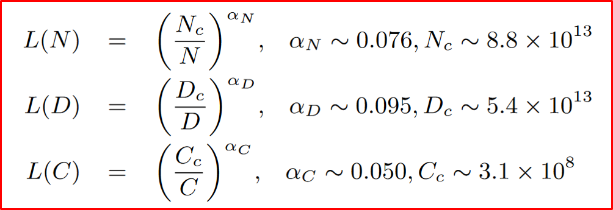

# The Larger the Model Size,  the Better the Performance? 

> Author: @Sakura
> Last Updated: 2024.5.27

## Scaling Law

In 2020, Kaplan et al. [1] (the OpenAI team) firstly proposed to model the power-law relationship of model performance with respective to three major factors, namely model size (N), dataset size (D), and the amount of training compute (C), for neural language models, and L(·) denotes the cross entropy loss in nats.1

    Figure. Three basic formulas for the scaling law1.

> 1. The statement and figure are adapted from Zhao et al. (2023) ’s work entitled *A Survey of Large Language Models*.

## An Analogy: Restaurant vs. LLM

Average Cost → Model Size
Dished Taste → Performance

## Mixtral(46.7B) Outperforms LLaMA-2(70B)

## Contamination on Benchmark

## References

[1] J. Kaplan, S. McCandlish, T. Henighan, T. B. Brown, B. Chess, R. Child, S. Gray, A. Radford, J. Wu, and D. Amodei, “Scaling laws for neural language models,” CoRR, vol. abs/2001.08361, 2020.

[2] DeepSeek-AI et al., ‘DeepSeek-V2: A Strong, Economical, and Efficient Mixture-of-Experts Language Model’. arXiv, May 24, 2024. doi: 10.48550/arXiv.2405.04434.

[3] A. Q. Jiang et al., ‘Mixtral of Experts’. arXiv, Jan. 08, 2024. Accessed: Apr. 15, 2024. [Online]. Available: <http://arxiv.org/abs/2401.04088>

[4] R. Xu, Z. Wang, R.-Z. Fan, and P. Liu, ‘Benchmarking Benchmark Leakage in Large Language Models’. arXiv, Apr. 29, 2024. doi: 10.48550/arXiv.2404.18824.
