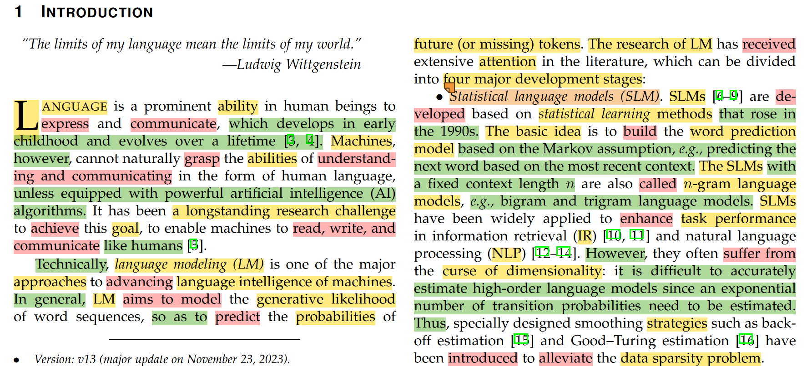
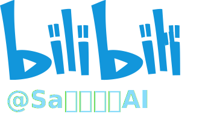
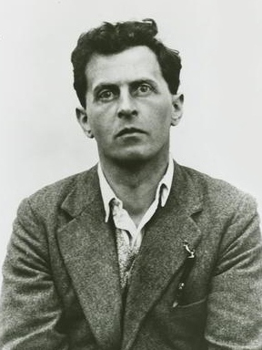

# 【论文导读】大语言模型综述（一）：介绍


## Info

```markdown
**视频简介** 
本系列为《A Survey of Large Language Model》的论文导读系列视频，本视频导读内容为论文的第一章，即Introduction部分。
本次介绍内容主要包括语言模型发展的四个阶段、大语言模型的突出能力、大语言模型的进展和挑战。  
论文引用：W. X. Zhao et al., ‘A Survey of Large Language Models’. arXiv, Nov. 24, 2023. doi: 10.48550/arXiv.2303.18223.  
推荐阅读：<https://github.com/RUCAIBox/LLMSurvey/blob/main/assets/LLM_Survey_Chinese.pdf>
笔记注记：
黄色：名词组分
粉色：动词组分
绿色：状语和修饰语组分
橙色：专有名词
视频内容/字幕勘误：  
1. LSTM的全称是Long Short-Term Memory
2. Multilayer perceptron的翻译应是多层感知机
3. ChatGPT在2022年11月31日发布
```



[【带注释】A Survey of Large Language Model.pdf](../../course_notes/Paper_with_Annotation/Zhao%20等%20-%202023%20-%20A%20Survey%20of%20Large%20Language%20Models.pdf)

## Further Reading

<!--  -->

“The limits of my language mean the limits of my world.”  
—Ludwig Wittgenstein



路德维希·约瑟夫·约翰·维特根斯坦(1889-1951)是一位奥地利哲学家，主要研究逻辑学、数学哲学、心灵哲学和语言哲学。<sup>1</sup>

> 1. [WikiPedia - Ludwig Wittgenstein](<https://en.wikipedia.org/wiki/Ludwig_Wittgenstein>)
