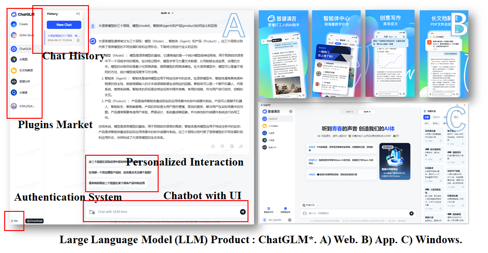
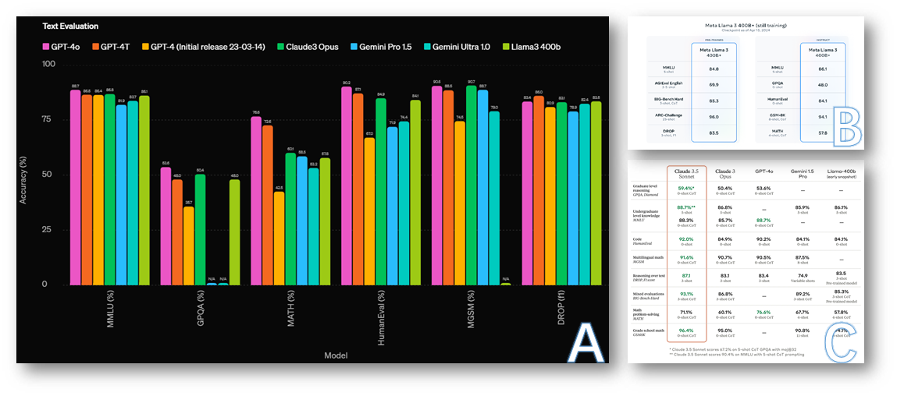
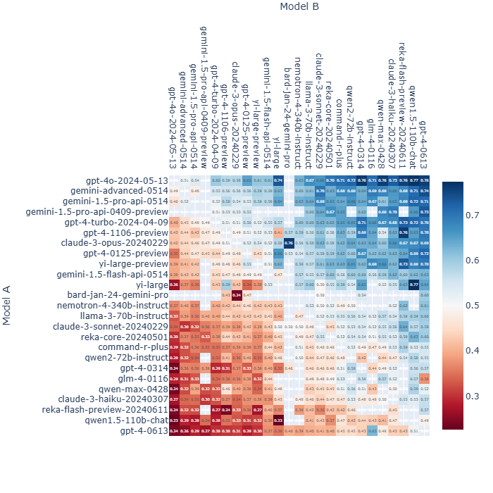

# 【论文导读】大语言模型综述（三）：主流大语言模型介绍

## Info

```markdown
**视频简介** 
本系列为《A Survey of Large Language Model》的论文导读系列视频，本视频导读内容为论文的第三章，即Resources of LLMs部分。
讲演大纲：
- Common Misleadings
	- Model, Agent and Product
	- Who is best
- Publicly Available or Proprietary
- LLaMA Series Model (Meta AI)
- GPT Series Model (OpenAI)
- Awesome Large Language Models
	- GLM Series (Zhipu AI & Tsinghua University)
	- Mixtral Series (Mistral AI)
	- Gemeni Series (Google)
	- Claude Series (Anthropic)
论文引用：
```

## Outline

- [Common Misunderstandings](#common-misunderstandings)
  - Model, Agent and Product
  - Who is best
- [Publicly Available or Proprietary](#publicly-available-or-proprietary)
- [LLaMA Series Model (Meta AI)](#llama-series-model-(meta-ai))
- [GPT Series Model (OpenAI)](#gpt-series-model-(openaI))
- [Awesome Large Language Models](#awesome-large-language-models)
  - [GLM Series (Zhipu AI & Tsinghua University)](#glm-series-(zhipu-ai-&-tsinghua-university))
  - [Mixtral Series (Mistral AI)](#mixstral-series-(mistral-ai))
  - [Gemeni Series (Google)](#gemeni-series-(google))
  - [Claude Series (Anthropic)](#claude-series-(anthropic))

## Common Misunderstandings

### Model, Agent and Product

#### Model


> https://www.youtube.com/watch?v=zjkBMFhNj_g
>
> https://www.jetson-ai-lab.com/tutorial_ollama.html

#### Agent


> https://chatgpt.com/

#### Product


> https://chatgpt.com/



>  https://chatglm.cn/

#### Relationship


### Who is best

#### Evalution LLMs on Benchmarks



<div align="center">
    Model performance on conventional benchmarks, be it MMLU (<a href="http://arxiv.org/abs/2009.03300">Hendrycks et al., 2021</a>), GPQA (<a href="http://arxiv.org/abs/2311.12022">Rein et al., 2023</a>), MATH (<a href="http://arxiv.org/abs/2103.03874">Hendrycks et al., 2021</a>), HumanEval (<a href="http://arxiv.org/abs/2107.03374">Chen et al., 2021</a>) and so on. A) GPT-4o*. B) LLaMA-3 400B*. C) Claude-3.5 Sonnet*.
</div>
#### Data contamination


<div align="center">
    Left: Contamination Ranking. Right: An overview of detecting approach (<a href="http://arxiv.org/abs/2406.00482">Xu et al., 2024</a>).
</div>
#### Evaluating LLMs by Human Preference


<div align="center">Chatbot Arena: An Open Platform for Evaluating LLMs by Human Preference.*</div>

> https://chat.lmsys.org




<div align="center">
Above:  Fraction of Model A wins for all non-tied A vs. B battles.
Below: Chatbot arena rank leaderboard (<a href="http://arxiv.org/abs/2403.04132">Chiang et al., 2024</a>).*
</div>


## Publicly Available or Proprietary

## LLaMA Series Model (Meta AI)

## GPT Series Model (OpenAI)

## Awesome Large Language Models

### GLM Series (Zhipu AI & Tsinghua University)

### Mixtral Series (Mistral AI)

### Gemeni Series (Google)

### Claude Series (Anthropic)

## References

Chen, M., Tworek, J., Jun, H., Yuan, Q., Pinto, H. P. de O., Kaplan, J., Edwards, H., Burda, Y., Joseph, N., Brockman, G., Ray, A., Puri, R., Krueger, G., Petrov, M., Khlaaf, H., Sastry, G., Mishkin, P., Chan, B., Gray, S., … Zaremba, W. (2021). *Evaluating Large Language Models Trained on Code* (arXiv:2107.03374). arXiv. http://arxiv.org/abs/2107.03374

Chiang, W.-L., Zheng, L., Sheng, Y., Angelopoulos, A. N., Li, T., Li, D., Zhang, H., Zhu, B., Jordan, M., Gonzalez, J. E., & Stoica, I. (2024). *Chatbot Arena: An Open Platform for Evaluating LLMs by Human Preference* (arXiv:2403.04132). arXiv. https://doi.org/10.48550/arXiv.2403.04132

Hendrycks, D., Burns, C., Basart, S., Zou, A., Mazeika, M., Song, D., & Steinhardt, J. (2021). *Measuring Massive Multitask Language Understanding* (arXiv:2009.03300). arXiv. https://doi.org/10.48550/arXiv.2009.03300

Hendrycks, D., Burns, C., Kadavath, S., Arora, A., Basart, S., Tang, E., Song, D., & Steinhardt, J. (2021). *Measuring Mathematical Problem Solving With the MATH Dataset* (arXiv:2103.03874). arXiv. https://doi.org/10.48550/arXiv.2103.03874

Rein, D., Hou, B. L., Stickland, A. C., Petty, J., Pang, R. Y., Dirani, J., Michael, J., & Bowman, S. R. (2023). *GPQA: A Graduate-Level Google-Proof Q&A Benchmark* (arXiv:2311.12022). arXiv. https://doi.org/10.48550/arXiv.2311.12022

Xu, R., Wang, Z., Fan, R.-Z., & Liu, P. (2024). *Benchmarking Benchmark Leakage in Large Language Models* (arXiv:2404.18824). arXiv. https://doi.org/10.48550/arXiv.2404.18824
