# 【论文导读】大语言模型综述（三）：主流大语言模型介绍

## Info

```markdown
**视频简介** 
本系列为《A Survey of Large Language Model》的论文导读系列视频，本视频导读内容为论文的第三章，即Resources of LLMs部分。
讲演大纲：
- Common Misleadings
	- Model, Agent and Product
	- Who is best
- Publicly Available or Proprietary
    - LLaMA Series Model (Meta AI)
    - GPT Series Model (OpenAI)
- Awesome Large Language Models
	- GLM Series (Zhipu AI & Tsinghua University)
	- Mixtral Series (Mistral AI)
	- Gemeni Series (Google)
	- Claude Series (Anthropic)
论文引用:
Bai, Y., Lv, X., Zhang, J., He, Y., Qi, J., Hou, L., Tang, J., Dong, Y., & Li, J. (2024). LongAlign: A Recipe for Long Context Alignment of Large Language Models (arXiv:2401.18058). arXiv. https://doi.org/10.48550/arXiv.2401.18058
Chen, M., Tworek, J., Jun, H., Yuan, Q., Pinto, H. P. de O., Kaplan, J., Edwards, H., Burda, Y., Joseph, N., Brockman, G., Ray, A., Puri, R., Krueger, G., Petrov, M., Khlaaf, H., Sastry, G., Mishkin, P., Chan, B., Gray, S., … Zaremba, W. (2021). Evaluating Large Language Models Trained on Code (arXiv:2107.03374). arXiv. http://arxiv.org/abs/2107.03374
Chiang, W.-L., Zheng, L., Sheng, Y., Angelopoulos, A. N., Li, T., Li, D., Zhang, H., Zhu, B., Jordan, M., Gonzalez, J. E., & Stoica, I. (2024). Chatbot Arena: An Open Platform for Evaluating LLMs by Human Preference (arXiv:2403.04132). arXiv. https://doi.org/10.48550/arXiv.2403.04132
Du, Z., Qian, Y., Liu, X., Ding, M., Qiu, J., Yang, Z., & Tang, J. (2022). GLM: General Language Model Pretraining with Autoregressive Blank Infilling (arXiv:2103.10360). arXiv. https://doi.org/10.48550/arXiv.2103.10360
GLM Team. (2024). ChatGLM: A Family of Large Language Models from GLM-130B to GLM-4 All Tools (arXiv:2406.12793). arXiv. https://doi.org/10.48550/arXiv.2406.12793
Hendrycks, D., Burns, C., Basart, S., Zou, A., Mazeika, M., Song, D., & Steinhardt, J. (2021). Measuring Massive Multitask Language Understanding (arXiv:2009.03300). arXiv. https://doi.org/10.48550/arXiv.2009.03300
Hendrycks, D., Burns, C., Kadavath, S., Arora, A., Basart, S., Tang, E., Song, D., & Steinhardt, J. (2021). Measuring Mathematical Problem Solving With the MATH Dataset (arXiv:2103.03874). arXiv. https://doi.org/10.48550/arXiv.2103.03874
Jiang, A. Q., Sablayrolles, A., Roux, A., Mensch, A., Savary, B., Bamford, C., Chaplot, D. S., Casas, D. de las, Hanna, E. B., Bressand, F., Lengyel, G., Bour, G., Lample, G., Lavaud, L. R., Saulnier, L., Lachaux, M.-A., Stock, P., Subramanian, S., Yang, S., … Sayed, W. E. (2024). Mixtral of Experts (arXiv:2401.04088). arXiv. http://arxiv.org/abs/2401.04088
Liu, X., Lai, H., Yu, H., Xu, Y., Zeng, A., Du, Z., Zhang, P., Dong, Y., & Tang, J. (2023). WebGLM: Towards An Efficient Web-Enhanced Question Answering System with Human Preferences (arXiv:2306.07906). arXiv. https://doi.org/10.48550/arXiv.2306.07906
Rein, D., Hou, B. L., Stickland, A. C., Petty, J., Pang, R. Y., Dirani, J., Michael, J., & Bowman, S. R. (2023). GPQA: A Graduate-Level Google-Proof Q&A Benchmark (arXiv:2311.12022). arXiv. https://doi.org/10.48550/arXiv.2311.12022
Rozière, B., Gehring, J., Gloeckle, F., Sootla, S., Gat, I., Tan, X. E., Adi, Y., Liu, J., Sauvestre, R., Remez, T., Rapin, J., Kozhevnikov, A., Evtimov, I., Bitton, J., Bhatt, M., Ferrer, C. C., Grattafiori, A., Xiong, W., Défossez, A., … Synnaeve, G. (2024). Code Llama: Open Foundation Models for Code (arXiv:2308.12950). arXiv. https://doi.org/10.48550/arXiv.2308.12950
Touvron, H., Lavril, T., Izacard, G., Martinet, X., Lachaux, M.-A., Lacroix, T., Rozière, B., Goyal, N., Hambro, E., Azhar, F., Rodriguez, A., Joulin, A., Grave, E., & Lample, G. (2023a). LLaMA: Open and Efficient Foundation Language Models (arXiv:2302.13971). arXiv. https://doi.org/10.48550/arXiv.2302.13971
Touvron, H., Martin, L., Stone, K., Albert, P., Almahairi, A., Babaei, Y., Bashlykov, N., Batra, S., Bhargava, P., Bhosale, S., Bikel, D., Blecher, L., Ferrer, C. C., Chen, M., Cucurull, G., Esiobu, D., Fernandes, J., Fu, J., Fu, W., … Scialom, T. (2023b). Llama 2: Open Foundation and Fine-Tuned Chat Models (arXiv:2307.09288). arXiv. https://doi.org/10.48550/arXiv.2307.09288
Xu, R., Wang, Z., Fan, R.-Z., & Liu, P. (2024). Benchmarking Benchmark Leakage in Large Language Models (arXiv:2404.18824). arXiv. https://doi.org/10.48550/arXiv.2404.18824
Zeng, A., Liu, X., Du, Z., Wang, Z., Lai, H., Ding, M., Yang, Z., Xu, Y., Zheng, W., Xia, X., Tam, W. L., Ma, Z., Xue, Y., Zhai, J., Chen, W., Zhang, P., Dong, Y., & Tang, J. (2022). GLM-130B: An Open Bilingual Pre-trained Model (arXiv:2210.02414). arXiv. https://doi.org/10.48550/arXiv.2210.02414
```

## Outline

- [Common Misunderstandings](#common-misunderstandings)
  - Model, Agent and Product
  - Who is best
- [Publicly Available or Proprietary](#publicly-available-or-proprietary)
- [LLaMA Series Model (Meta AI)](#llama-series-model-(meta-ai))
- [GPT Series Model (OpenAI)](#gpt-series-model-(openaI))
- [Awesome Large Language Models](#awesome-large-language-models)
  - [GLM Series (Zhipu AI & Tsinghua University)](#glm-series-(zhipu-ai-&-tsinghua-university))
  - [Mixtral Series (Mistral AI)](#mixstral-series-(mistral-ai))
  - [Gemeni Series (Google)](#gemeni-series-(google))
  - [Claude Series (Anthropic)](#claude-series-(anthropic))

## Common Misunderstandings

### Model, Agent and Product

#### Model


<div align="center">Illustration of how we get LLaMA-2 70B.*</div>

> https://www.youtube.com/watch?v=zjkBMFhNj_g

<div align="center">
  <div style="display: flex; justify-content: center; align-items: center;">
    
    
  </div>
  <p>Left: Core files of LLaMA-2.* Right: Ollama runs a large language model with command line interface.*</p>
</div>


> https://www.youtube.com/watch?v=zjkBMFhNj_g
>
> https://www.jetson-ai-lab.com/tutorial_ollama.html

#### Agent

<div align="center">
    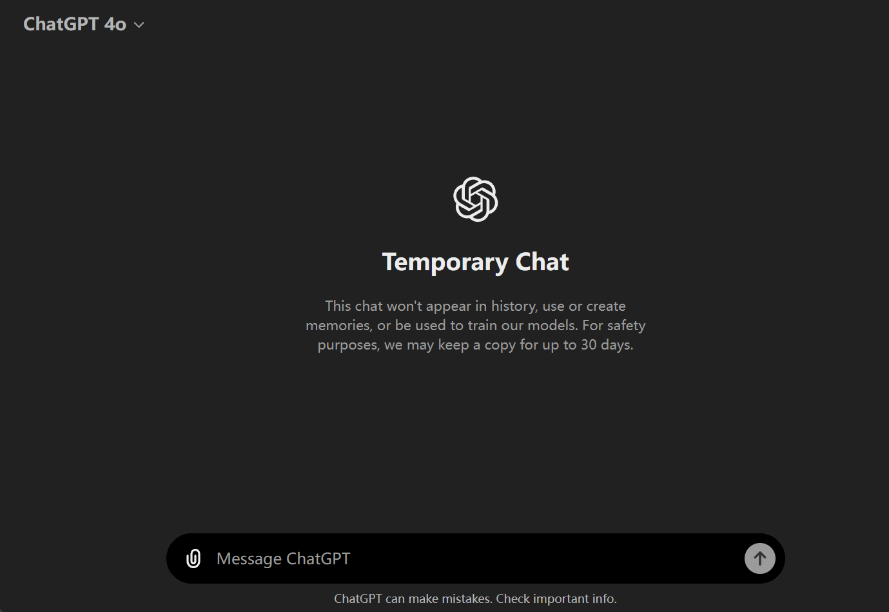
    <p>Agent based on gpt-4o.*</p>
    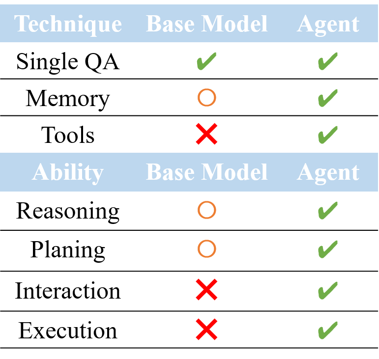
    <p>Agent vs. base model.</p>
</div>


> https://chatgpt.com/

#### Product

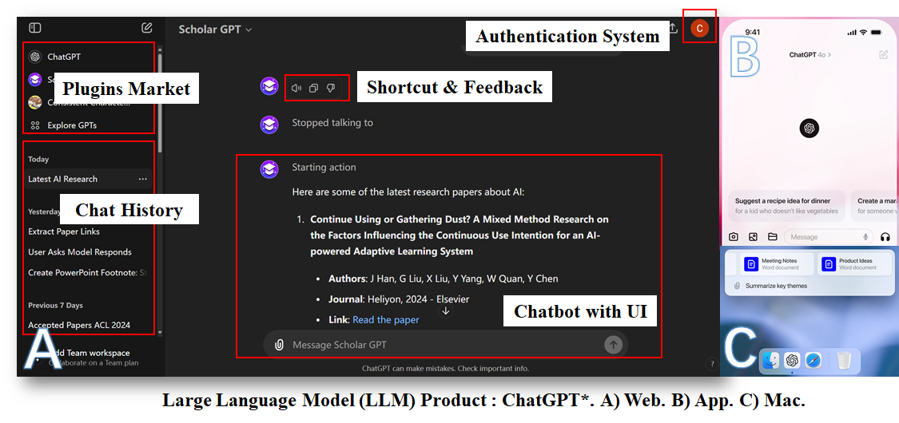

> https://chatgpt.com/


>  https://chatglm.cn/

#### Relationship

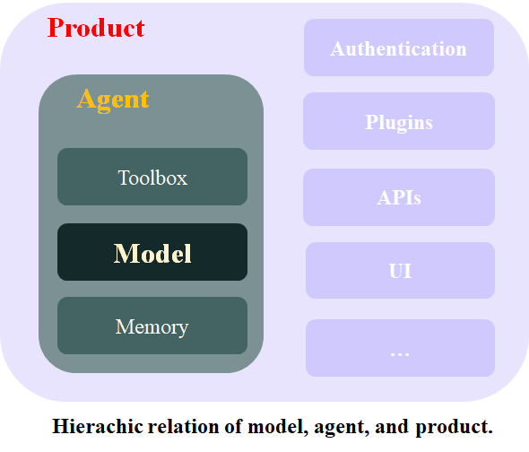

### Who is best

#### Evalution LLMs on Benchmarks


<div align="center">
    Model performance on conventional benchmarks, be it MMLU (<a href="http://arxiv.org/abs/2009.03300">Hendrycks et al., 2021</a>), GPQA (<a href="http://arxiv.org/abs/2311.12022">Rein et al., 2023</a>), MATH (<a href="http://arxiv.org/abs/2103.03874">Hendrycks et al., 2021</a>), HumanEval (<a href="http://arxiv.org/abs/2107.03374">Chen et al., 2021</a>) and so on. A) GPT-4o*. B) LLaMA-3 400B*. C) Claude-3.5 Sonnet*.
</div>

#### Data contamination

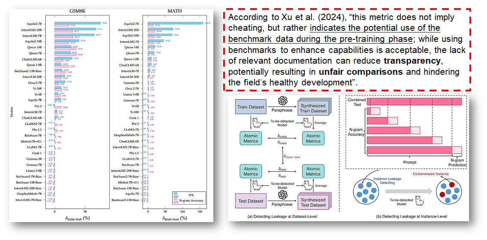

<div align="center">
    Left: Contamination Ranking. Right: An overview of detecting approach (<a href="http://arxiv.org/abs/2406.00482">Xu et al., 2024</a>).
</div>

#### Evaluating LLMs by Human Preference

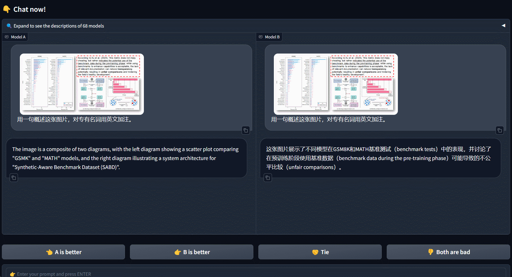

<div align="center">Chatbot Arena: An Open Platform for Evaluating LLMs by Human Preference.*</div>

> https://chat.lmsys.org


<div align="center">
Above:  Fraction of Model A wins for all non-tied A vs. B battles.
Below: Chatbot arena rank leaderboard (<a href="http://arxiv.org/abs/2403.04132">Chiang et al., 2024</a>).*
</div>


## Publicly Available or Proprietary

## LLaMA Series Model ([Meta AI](https://ai.meta.com/) )

### Model Files in Huggingface (AI researcher recommended)


<div align="center">A) LLaMA-2 7B chat model file in Huggingface*. B) Use Transformers to run the model. C) Transparent model architectures and parameters.</div>

> https://huggingface.co/

### Model Files in Ollama (application developer recommended)

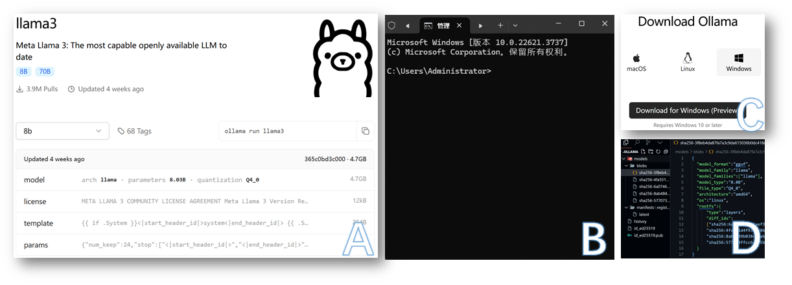

<div align="center">A) LLaMA-3 8B chat model file in Ollama*. B) Run LLaMA locally using Ollama. C) Ollama application supports mac, linux and windows platforms. D) Storage directory.</div>

> https://ollama.com/

### Evolution of LLaMA

<table>
  <tr>
    <th>Name</th>
    <th>Release date</th>
    <th>Parameters</th>
    <th>Training cost (petaFLOP-day)</th>
    <th>Context length</th>
    <th>Corpus size</th>
    <th>Commercial viability?</th>
  </tr>
  <tr>
    <td rowspan="4">LLaMA (discard) (<a href="http://arxiv.org/abs/2302.13971">Touvron et al., 2023a</a>)</td>
    <td rowspan="4">February 24, 2023</td>
    <td>6.7B</td>
    <td rowspan="4">6,300</td>
    <td rowspan="4">2048</td>
    <td rowspan="4">1–1.4T</td>
    <td rowspan="4" style="background-color: #f8d7da;">No</td>
  </tr>
  <tr>
    <td>13B</td>
  </tr>
  <tr>
    <td>32.5B</td>
  </tr>
  <tr>
    <td>65.2B</td>
  </tr>
  <tr>
    <td rowspan="3">LLaMA 2 (<a href="http://arxiv.org/abs/2307.09288">Touvron et al., 2023b</a>)</td>
    <td rowspan="3">July 18, 2023</td>
    <td>6.7B</td>
    <td rowspan="3">21,000</td>
    <td rowspan="3">4096</td>
    <td rowspan="3">2T</td>
    <td rowspan="3" style="background-color: #d4edda;">Yes</td>
  </tr>
  <tr>
    <td>13B</td>
  </tr>
  <tr>
    <td>69B</td>
  </tr>
  <tr>
    <td rowspan="4">Code LLaMA (<a href="http://arxiv.org/abs/2308.12950">Rozière et al., 2024</a>)</td>
    <td rowspan="4">August 24, 2023</td>
    <td>6.7B</td>
    <td rowspan="4"></td>
    <td rowspan="4">4096</td>
    <td rowspan="4">2T</td>
    <td rowspan="4" style="background-color: #d4edda;">Yes</td>
  </tr>
  <tr>
    <td>13B</td>
  </tr>
  <tr>
    <td>33.7B</td>
  </tr>
  <tr>
    <td>69B</td>
  </tr>
  <tr>
    <td rowspan="4">LLaMA 3</td>
    <td rowspan="4">April 18, 2024</td>
    <td>8B</td>
    <td rowspan="4">100,000</td>
    <td rowspan="4">8192</td>
    <td rowspan="4">15T</td>
    <td rowspan="4" style="background-color: #d4edda;">Yes</td>
  </tr>
  <tr>
    <td>70.6B</td>
  </tr>
  <tr>
    <td>400B+ (unreleased)</td>
  </tr>
</table>


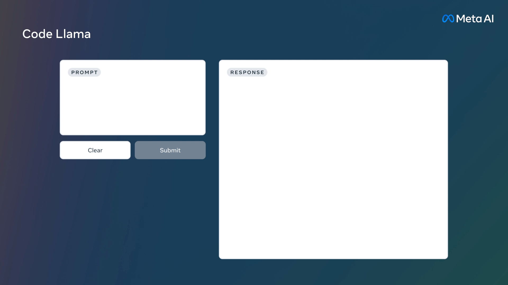

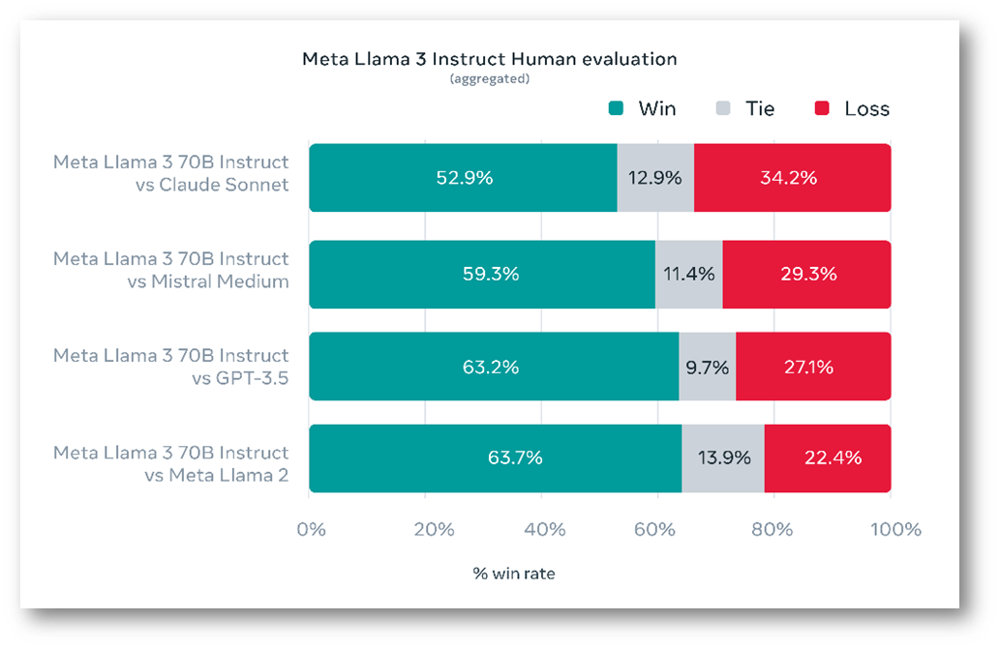

<div align="center">A) LLaMA-2. B) Code LLaMA. C) LLaMA-3.</div>

### Importance of Instruction Tuning

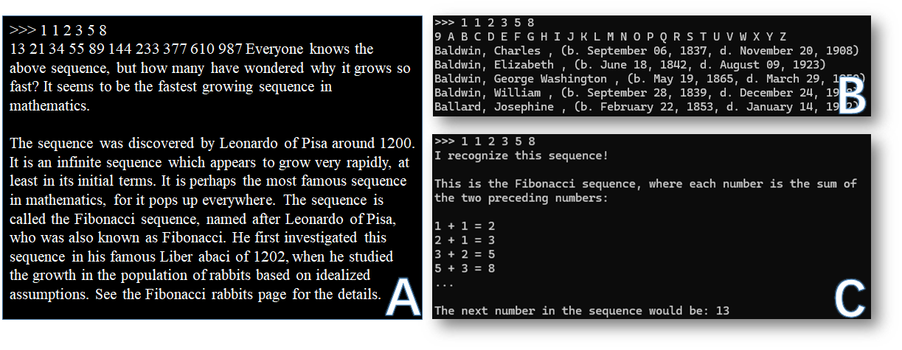

<div align="center">Given the prompt “1 1 2 3 5 8”, the completetion of different LLaMA models. A) LLaMA-65B (without instruction tuning) (<a href="http://arxiv.org/abs/2302.13971">Touvron et al., 2023a</a>). B) LLaMA-3-8B (without instruction tuning). C) LLaMA-3-8B-chat</div>

## GPT Series Model ([OpenAI](https://openai.com) )

### Access GPT by APIs

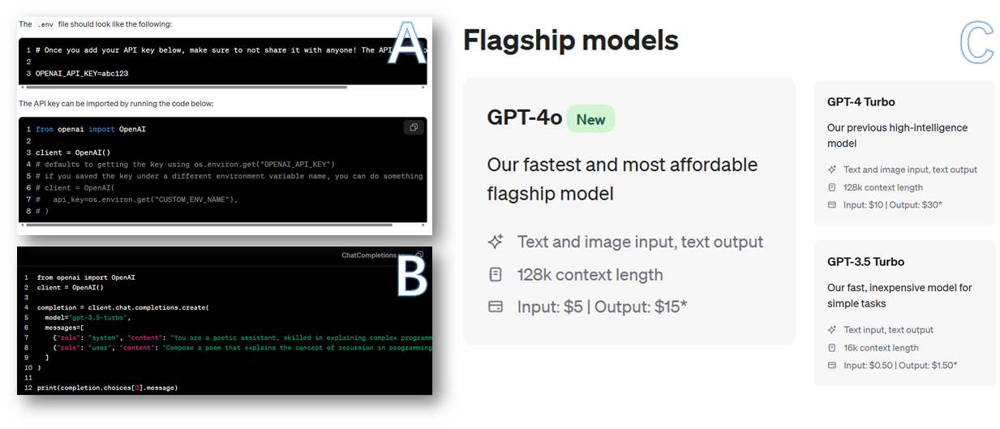

<div align="center">Quick start of using OpenAI APIs to access GPT models.* A) Set OPENAI_API_KEY in “.env”. B) Chat with GPT in python. C) Heating models.</div>

> [https://](https://platform.openai.com/docs/models)[platform.openai.com/docs/models](https://platform.openai.com/docs/models)
>
> https://platform.openai.com/docs/quickstart

### Well-developed LLM-based Product


<div align="center">LangChain-Chatchat* Web UI Demo.</div>

> https://github.com/chatchat-space/Langchain-Chatchat/

## Awesome Large Language Models

### GLM Series ([Zhipu AI](https://www.zhipuai.cn/) & [Tsinghua University](https://www.tsinghua.edu.cn/en/index.htm) )

GLM ([Du et al., 2022](http://arxiv.org/abs/2103.10360)) → GLM-130B ([Zeng et al., 2022](http://arxiv.org/abs/2210.02414)) → ChatGLM-6B [[GitHub](https://github.com/THUDM/ChatGLM-6B), 2023] → WebGLM ([Liu et al., 2023](http://arxiv.org/abs/2306.07906)) → ChatGLM2-6B [[GitHub](https://github.com/THUDM/ChatGLM2-6B), 2023] → ChatGLM3-6B [[GitHub](https://github.com/THUDM/ChatGLM3), 2023] → GLM4-9B ([GLM ](http://arxiv.org/abs/2406.12793)[Team, 2024](http://arxiv.org/abs/2406.12793))

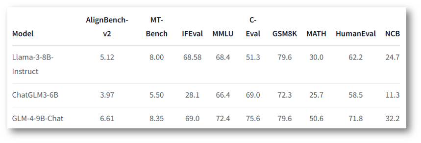

<div align="center">GLM-4 performance on benchmarks. </div>


<div align="center">GLM-4 performance on LongBench-Chat (<a href="http://arxiv.org/abs/2401.18058">Bai et al., 2024</a>). </div>

### Mixtral Series ([Mistral AI](https://mistral.ai/) )


<div align="center">Mistral 7B (<a href="http://arxiv.org/abs/2401.04088">Jiang et al., 2024</a>), Mixtral 8x7B (<a href="http://arxiv.org/abs/2401.04088">Jiang et al., 2024</a>) and Mixtral 8x22B* all belong to a family of highly efficient models compared to the other open models. A) Measure of the performance (MMLU) versus inference budget tradeoff (number of active parameters). B) Maths & Coding. C) Reasoning and knowledge.</div>

> https://mistral.ai/news/mixtral-8x22b/


### Claude Series ([Anthropic](https://www.anthropic.com/) )


<div align="center">Introducing Claude 3.5 Sonnet.* (Model size of Claude 3 Haiku, Sonnet and Opus are estimated as 20B, 70B and 2T respectively).</div>

> https://www.anthropic.com/news/claude-3-5-sonnet

### Gemeni Series ([Google](https://research.google/) )


<div align="center">Access Google’s most capable AI models with Gemini Advanced (Gemini 1.5 Pro).*</div>

> https://www.youtube.com/watch?v=25A-jj61z7w

## References

Bai, Y., Lv, X., Zhang, J., He, Y., Qi, J., Hou, L., Tang, J., Dong, Y., & Li, J. (2024). *LongAlign: A Recipe for Long Context Alignment of Large Language Models* (arXiv:2401.18058). arXiv. https://doi.org/10.48550/arXiv.2401.18058

Chen, M., Tworek, J., Jun, H., Yuan, Q., Pinto, H. P. de O., Kaplan, J., Edwards, H., Burda, Y., Joseph, N., Brockman, G., Ray, A., Puri, R., Krueger, G., Petrov, M., Khlaaf, H., Sastry, G., Mishkin, P., Chan, B., Gray, S., … Zaremba, W. (2021). *Evaluating Large Language Models Trained on Code* (arXiv:2107.03374). arXiv. http://arxiv.org/abs/2107.03374

Chiang, W.-L., Zheng, L., Sheng, Y., Angelopoulos, A. N., Li, T., Li, D., Zhang, H., Zhu, B., Jordan, M., Gonzalez, J. E., & Stoica, I. (2024). *Chatbot Arena: An Open Platform for Evaluating LLMs by Human Preference* (arXiv:2403.04132). arXiv. https://doi.org/10.48550/arXiv.2403.04132

Du, Z., Qian, Y., Liu, X., Ding, M., Qiu, J., Yang, Z., & Tang, J. (2022). *GLM: General Language Model Pretraining with Autoregressive Blank Infilling* (arXiv:2103.10360). arXiv. https://doi.org/10.48550/arXiv.2103.10360

GLM Team. (2024). *ChatGLM: A Family of Large Language Models from GLM-130B to GLM-4 All Tools* (arXiv:2406.12793). arXiv. https://doi.org/10.48550/arXiv.2406.12793

Hendrycks, D., Burns, C., Basart, S., Zou, A., Mazeika, M., Song, D., & Steinhardt, J. (2021). *Measuring Massive Multitask Language Understanding* (arXiv:2009.03300). arXiv. https://doi.org/10.48550/arXiv.2009.03300

Hendrycks, D., Burns, C., Kadavath, S., Arora, A., Basart, S., Tang, E., Song, D., & Steinhardt, J. (2021). *Measuring Mathematical Problem Solving With the MATH Dataset* (arXiv:2103.03874). arXiv. https://doi.org/10.48550/arXiv.2103.03874

Jiang, A. Q., Sablayrolles, A., Roux, A., Mensch, A., Savary, B., Bamford, C., Chaplot, D. S., Casas, D. de las, Hanna, E. B., Bressand, F., Lengyel, G., Bour, G., Lample, G., Lavaud, L. R., Saulnier, L., Lachaux, M.-A., Stock, P., Subramanian, S., Yang, S., … Sayed, W. E. (2024). *Mixtral of Experts* (arXiv:2401.04088). arXiv. http://arxiv.org/abs/2401.04088

Liu, X., Lai, H., Yu, H., Xu, Y., Zeng, A., Du, Z., Zhang, P., Dong, Y., & Tang, J. (2023). *WebGLM: Towards An Efficient Web-Enhanced Question Answering System with Human Preferences* (arXiv:2306.07906). arXiv. https://doi.org/10.48550/arXiv.2306.07906

Rein, D., Hou, B. L., Stickland, A. C., Petty, J., Pang, R. Y., Dirani, J., Michael, J., & Bowman, S. R. (2023). *GPQA: A Graduate-Level Google-Proof Q&A Benchmark* (arXiv:2311.12022). arXiv. https://doi.org/10.48550/arXiv.2311.12022

Rozière, B., Gehring, J., Gloeckle, F., Sootla, S., Gat, I., Tan, X. E., Adi, Y., Liu, J., Sauvestre, R., Remez, T., Rapin, J., Kozhevnikov, A., Evtimov, I., Bitton, J., Bhatt, M., Ferrer, C. C., Grattafiori, A., Xiong, W., Défossez, A., … Synnaeve, G. (2024). *Code Llama: Open Foundation Models for Code* (arXiv:2308.12950). arXiv. https://doi.org/10.48550/arXiv.2308.12950

Touvron, H., Lavril, T., Izacard, G., Martinet, X., Lachaux, M.-A., Lacroix, T., Rozière, B., Goyal, N., Hambro, E., Azhar, F., Rodriguez, A., Joulin, A., Grave, E., & Lample, G. (2023a). *LLaMA: Open and Efficient Foundation Language Models* (arXiv:2302.13971). arXiv. https://doi.org/10.48550/arXiv.2302.13971

Touvron, H., Martin, L., Stone, K., Albert, P., Almahairi, A., Babaei, Y., Bashlykov, N., Batra, S., Bhargava, P., Bhosale, S., Bikel, D., Blecher, L., Ferrer, C. C., Chen, M., Cucurull, G., Esiobu, D., Fernandes, J., Fu, J., Fu, W., … Scialom, T. (2023b). *Llama 2: Open Foundation and Fine-Tuned Chat Models* (arXiv:2307.09288). arXiv. https://doi.org/10.48550/arXiv.2307.09288

Xu, R., Wang, Z., Fan, R.-Z., & Liu, P. (2024). *Benchmarking Benchmark Leakage in Large Language Models* (arXiv:2404.18824). arXiv. https://doi.org/10.48550/arXiv.2404.18824

Zeng, A., Liu, X., Du, Z., Wang, Z., Lai, H., Ding, M., Yang, Z., Xu, Y., Zheng, W., Xia, X., Tam, W. L., Ma, Z., Xue, Y., Zhai, J., Chen, W., Zhang, P., Dong, Y., & Tang, J. (2023). *GLM-130B: An Open Bilingual Pre-trained Model* (arXiv:2210.02414). arXiv. https://doi.org/10.48550/arXiv.2210.02414
