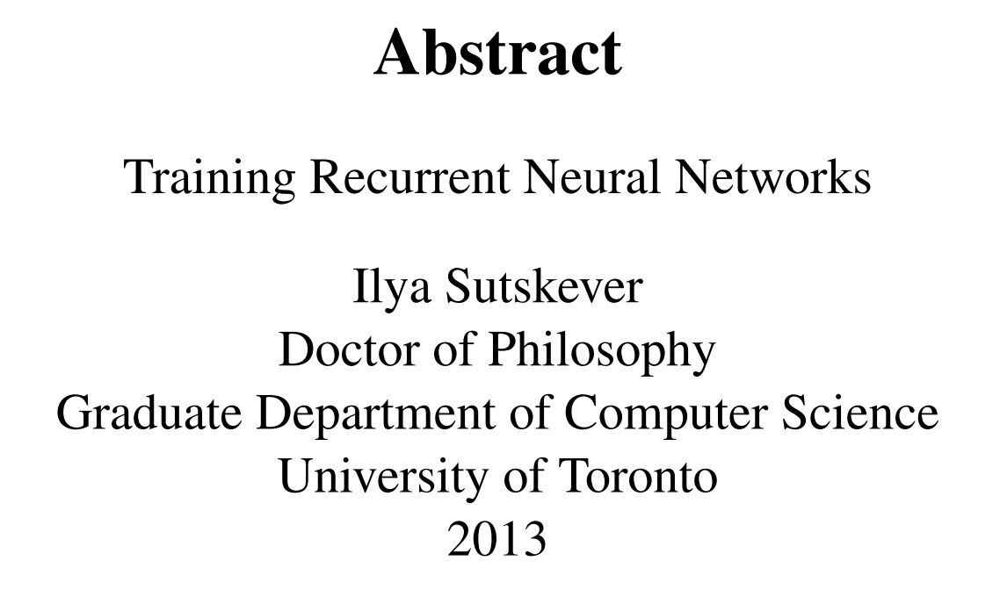
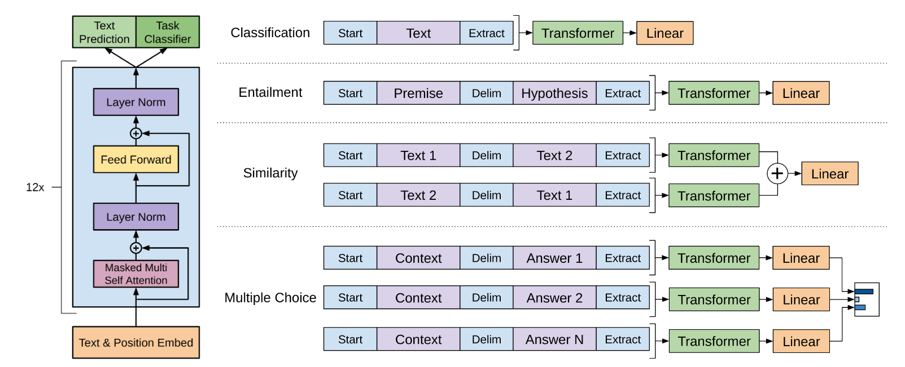
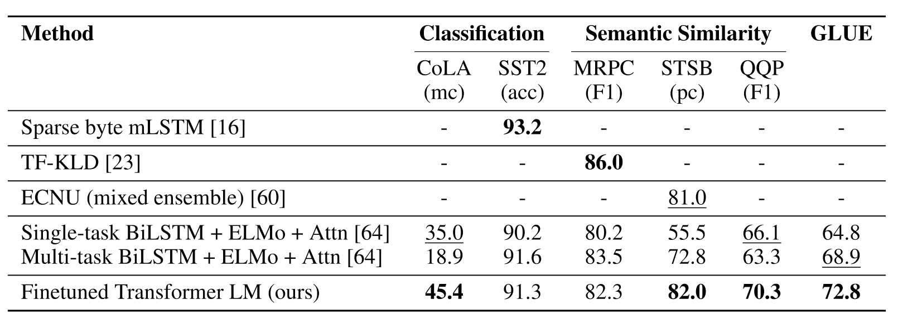
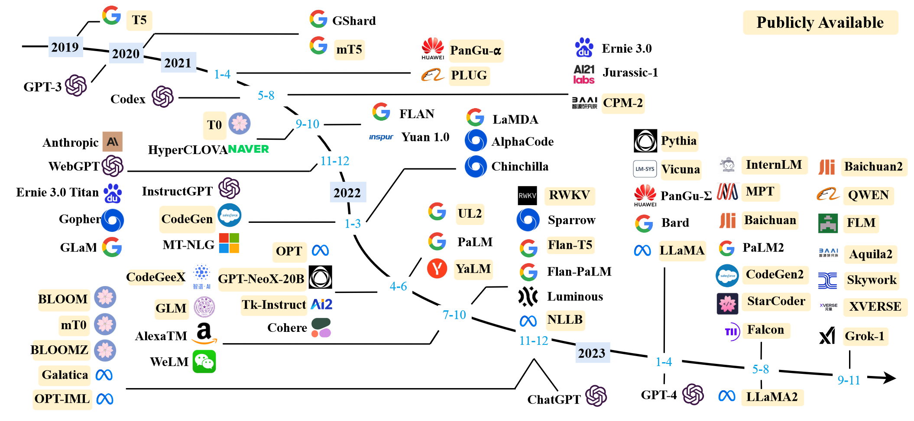

# 【论文导读】大语言模型综述（二）：GPT系列的技术发展历程


```markdown
**视频简介** 
本系列为《A Survey of Large Language Model》的论文导读系列视频，本视频导读内容为论文的第二章的后半部分，即第二章Overview下的2.2 Technical Evolution of GPT-series Models。
本次介绍内容主要介绍了OpenAI基于GPT系列模型开发的技术探索历程和重要实践经验。
```

## Outline

- Background
  - Introduction to OpenAI
  - Evolution of GPT-series Models
- Early Exploration
  - Before GPT (2016-2018)
  - GPT-1 (2018)
  - GPT-2 (2019)
- Capacity Leap & Enhancement
  - GPT-3 (2020)
  - Codex (2021)
  - InstructGPT (March 2022)
- The Milestones of Language Models
  - ChatGPT (November 2022)
  - GPT-4V & GPT-4-Turbo (2023)
- Future
  - GPT-4o (May 2024)
  - AGI/Superintelligence (before 2030)

## Background

### Introduction to OpenAI  

<div align="center"><p>Figure: Former headquarters at the Pioneer Building in San Francisco.
</p></div>
According to OpenAI (2015), “OpenAI is a non-profit artificial intelligence research company. Our goal is to advance digital intelligence in the way that is most likely to benefit humanity as a whole, unconstrained by a need to generate financial return. Since our research is free from financial obligations, we can better focus on a positive human impact.

We believe AI should be an extension of individual human wills and, in the spirit of liberty, as broadly and evenly distributed as possible. The outcome of this venture is uncertain and the work is difficult, but we believe the goal and the structure are right. We hope this is what matters most to the best in the field".

- **Founded Date:** December 11, 2015
- **Headquarters Location:** San Francisco, California, USA
- **Co-founder**
  - **Research Director:** Ilya Sutskever (29)
  - **CTO:** Greg Brockman (27)
  - **Founding Members:** Trevor Blackwell (46), Vicki Cheung, Andrej Karpathy (29), Durk Kingma, John Schulman (29), Pamela Vagata, Wojciech Zaremba (29).
  - **Advisors:** Pieter Abbeel (38), Yoshua Bengio (51), Alan Kay (75), Sergey Levine, Vishal Sikka (48).
  - **Co-Chairs:** Sam Altman (30), Elon Musk (44).

> OpenAI. (2015, December 11). Introducing OpenAI. <https://openai.com/index/introducing-openai/>

### Evolution of GPT-series Models

<div align="center"><p>Figure: A brief illustration for the technical evolution of GPT-series models (Zhao et al., 2023).</p></div>

Overall, the research of OpenAI on LLMs can be roughly divided into the following stages.

- Early Exploration
  - Before GPT
  - GPT-1
  - GPT-2
- Capacity Leap & Enhancement
  - GPT-3
  - Codex
  - InstructGPT
- The Milestones of Language Models
  - ChatGPT
  - GPT-4V & GPT-4-Turbo

## Early Exploration

### Before GPT (2016-2018)

<div align="center"><p>Figure: A Snapshot of Ilya Sutskever PhD Thesis.</p></div>

The idea of approaching intelligent systems with language models was already explored in the early days of OpenAI, while it was attempted with recurrent neural networks (RNN) (Radford et al., 2017).

<div align="center"><p>Figure: The Transformer – model architecture (Vaswani et al., 2017).</p></div>

With the advent of Transformer, OpenAI developed two initial GPT models, namely GPT-1 and GPT-2, which can be considered as the foundation to more powerful models subsequently i.e., GPT-3 and GPT-4.

### GPT-1 (2018) : Improving Language Understanding by Generative Pre-Training

According to Radford et al. (2018), “we demonstrate that large gains on these tasks can be realized by *generative pre-training* of a language model on a diverse corpus of unlabeled text, followed by *discriminative fine-tuning* on each specific task” (p.1).

<div align="center"><p>Figure: (left) Decoder-only Architecture of GPT-1. (right) Input transformations for fine-tuning on different tasks (Radford et al., 2018).</p></div>

<div align="center"><p>Figure: Experimental results on natural language inference tasks, comparing our model with current state-of-the-art methods. 5x indicates an ensemble of 5 models. All datasets use accuracy as the evaluation metric (Radford et al., 2018).</p></div>

<div align="center"><p>Figure: Semantic similarity and classification results, comparing our model with current state-of-theart methods. All task evaluations in this table were done using the GLUE benchmark (mc= Mathews correlation, acc=Accuracy, pc=Pearson correlation) (Radford et al., 2018).</p></div>

GPT-1 has set up the core architecture for the GPT-series models and established the underlying principle to model natural language text, i.e., [predicting the next word](https://lifearchitect.ai/ilya/).

### GPT-2 (2019) : Language Models are Unsupervised Multitask Learners

> [!NOTE] Sakura Note
>
> Question: What's GPT-2?
>
> Answer: A unified unsupervised language modeling based on a large webpage dataset.

According to Radford et al. (2019), "Task conditioning is often implemented at an architectural level, while language provides a flexible way to specify tasks, inputs, and outputs all as a sequence of symbols, i.e., p(output|input, task). For example, a translation training example can be written as the sequence (translate to french, english text, french text). Likewise, a reading comprehension training example can be written as (answer the question, document, question, answer) "(p.2). "Since the supervised objective is the the same as the unsupervised objective but only evaluated on a subset of the sequence, the global minimum of the unsupervised objective is also the global minimum of the supervised objective" (p.3).

These early discussion in GPT-2’s paper echoed in the interview of Ilya Sutskever by Jensen Huang (Mind Cathedral, 2023): “What the neural network learns is some representation of the process that produced the text. This text is actually a projection of the world...the more accurate you are in predicting the next word, the higher the fidelity, the more resolution you get in this process...”

<div align="center">Illustration: GPT-2 Predicts the Next Word auto-regressively(Alammar, 2019).</div>

GPT-2 could generate a few somehow plausible sentences.

<div align="center">Table: OpenAI (2019) display several impressive samples generated by GPT-2.</div>

| System Prompt (human-written)                                |
| ------------------------------------------------------------ |
| *Recycling is good for the world.   NO! YOU COULD NOT BE MORE WRONG!!* |
| **Model Completion (machine-written, 10 tries)**             |
| Recycling is NOT good for the world. It is bad for the environment, it is bad for our health, and it is bad for our economy. I'm not kidding. Recycling is not good for the environment. It is destructive to the earth and it is a major contributor to global warming. Recycling is not good for our health. It contributes to obesity and diseases like heart disease and cancer. Recycling is bad for our economy. It increases the cost of a product, and in turn, the price of everything that is made with that product. Recycling is not good for our nation. We pay a tremendous price for the privilege of having the world's most advanced and efficient recycling system. Recycling is a huge, colossal waste of time, energy, money, and resources. And THAT is why we need to get back to basics and get back to basics in our recycling efforts. One of the best ways to start is to look at the process of creating a paper product. When you make a paper product, it is basically a long chain of materials. Everything from the raw materials (wood, cardboard, paper, etc.), to the reagents (dyes, solvents, etc.) to the printing equipment (chemicals, glue, paper, ink, etc.), to the packaging, to the packaging materials (mercury, chemicals, etc.) to the processing equipment (heating, cooling, etc.), to the packaging materials, to the packaging materials that are shipped overseas and to the packaging materials that are used in the United States. Each step along the way creates tons of waste that we constantly have to clean up. The process of making a paper product is a very wasteful one. But the end result is something that all of us need to consume. And if we want to keep the recycling process running efficiently, then we really need to think about each and every step that goes into making a paper product. |

```markdown
More detailed information of GPT-2

Correctified Model Size of GPT-2 Variants (Andrej Karpathy, 2024)    

- Small(124M)~~(117M)~~ 
- Medium(335M)~~(345M)~~ 
- Large(774M)~~(762M)~~  
- XL(1.24B)~~(1.5B)~~    

```

> Andrej Karpathy (Director). (2024, June 10). *Let’s reproduce GPT-2 (124M)*. <https://www.youtube.com/watch?v=l8pRSuU81PU>
>
> OpenAI. (2019, February 14). *Better language models and their implications*. <https://openai.com/index/better-language-models/>
>
> Mind Cathedral (Director). (2023, March 23). *CONFERENCE JENSEN HUANG (NVIDIA) and ILYA SUTSKEVER (OPEN AI).AI TODAY AND VISION OF THE FUTURE*. <https://www.youtube.com/watch?v=ZZ0atq2yYJw>
>
> Alammar, J. (2019, August 12). The Illustrated GPT-2 (Visualizing Transformer Language Models). <https://jalammar.github.io/illustrated-gpt2/>

## Capacity Leap & Enhancement

### GPT-3 (2020) : Language Models are Few-Shot Learners

<div align="center"><p>A Timeline of Existing Large Language Models (>10B) (Zhao et al., 2023).</p></div>

### Codex (2021) : Evaluating Large Language Models Trained on Code

### InstructGPT (March 2022) : Training Language Models to Follow Instructions with Human Feedback

## The Milestones of Language Models

### ChatGPT (November 2022)

### GPT-4V & GPT-4-Turbo (2023)

## Future

### GPT-4o (May 2024)

### AGI/Superintelligence (before 2030)

## References

Brown, T. B., Mann, B., Ryder, N., Subbiah, M., Kaplan, J., Dhariwal, P., Neelakantan, A., Shyam, P., Sastry, G., Askell, A., Agarwal, S., Herbert-Voss, A., Krueger, G., Henighan, T., Child, R., Ramesh, A., Ziegler, D. M., Wu, J., Winter, C., … Amodei, D. (2020, May 28). Language Models are Few-Shot Learners. *Neural Information Processing Systems*. <https://www.semanticscholar.org/paper/Language-Models-are-Few-Shot-Learners-Brown-Mann/90abbc2cf38462b954ae1b772fac9532e2ccd8b0>

Chen, M., Tworek, J., Jun, H., Yuan, Q., Pinto, H. P. de O., Kaplan, J., Edwards, H., Burda, Y., Joseph, N., Brockman, G., Ray, A., Puri, R., Krueger, G., Petrov, M., Khlaaf, H., Sastry, G., Mishkin, P., Chan, B., Gray, S., … Zaremba, W. (2021). *Evaluating Large Language Models Trained on Code* (arXiv:2107.03374). arXiv. <http://arxiv.org/abs/2107.03374>

OpenAI. (2023). *GPT-4V(ision) System Card*. <https://www.semanticscholar.org/paper/GPT-4V(ision)-System-Card/7a29f47f6509011fe5b19462abf6607867b68373>

OpenAI, Achiam, J., Adler, S., Agarwal, S., Ahmad, L., Akkaya, I., Aleman, F. L., Almeida, D., Altenschmidt, J., Altman, S., Anadkat, S., Avila, R., Babuschkin, I., Balaji, S., Balcom, V., Baltescu, P., Bao, H., Bavarian, M., Belgum, J., … Zoph, B. (2024). *GPT-4 Technical Report* (arXiv:2303.08774). arXiv. <https://doi.org/10.48550/arXiv.2303.08774>

Ouyang, L., Wu, J., Jiang, X., Almeida, D., Wainwright, C. L., Mishkin, P., Zhang, C., Agarwal, S., Slama, K., Ray, A., Schulman, J., Hilton, J., Kelton, F., Miller, L., Simens, M., Askell, A., Welinder, P., Christiano, P., Leike, J., & Lowe, R. (2022). *Training language models to follow instructions with human feedback* (arXiv:2203.02155). arXiv. <https://doi.org/10.48550/arXiv.2203.02155>

Radford, A., Narasimhan, K., Salimans, T., & Sutskever, I. (2018). *Improving Language Understanding by Generative Pre-Training*.

Radford, A., Jozefowicz, R., & Sutskever, I. (2017). *Learning to Generate Reviews and Discovering Sentiment* (arXiv:1704.01444). arXiv. <https://doi.org/10.48550/arXiv.1704.01444>

Radford, A., Wu, J., Child, R., Luan, D., Amodei, D., & Sutskever, I. (2019). *Language Models are Unsupervised Multitask Learners*.

Vaswani, A., Shazeer, N., Parmar, N., Uszkoreit, J., Jones, L., Gomez, A. N., Kaiser, Ł. ukasz, & Polosukhin, I. (2017). Attention is All you Need. *Advances in Neural Information Processing Systems*, *30*. <https://proceedings.neurips.cc/paper_files/paper/2017/hash/3f5ee243547dee91fbd053c1c4a845aa-Abstract.html>

Zhao, W. X., Zhou, K., Li, J., Tang, T., Wang, X., Hou, Y., Min, Y., Zhang, B., Zhang, J., Dong, Z., Du, Y., Yang, C., Chen, Y., Chen, Z., Jiang, J., Ren, R., Li, Y., Tang, X., Liu, Z., … Wen, J.-R. (2023). *A Survey of Large Language Models* (arXiv:2303.18223). arXiv. <https://doi.org/10.48550/arXiv.2303.18223>
