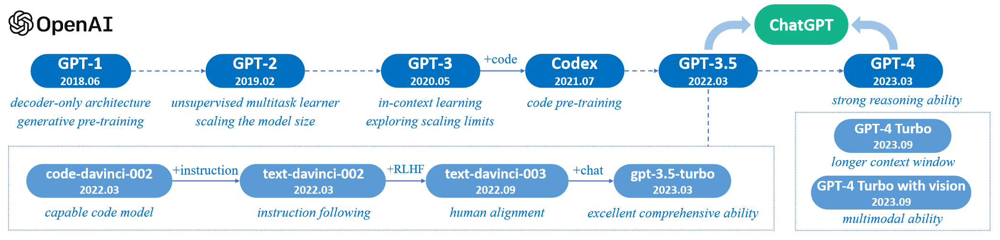

# 【论文导读】大语言模型综述（二）：GPT系列的技术发展历程


```markdown
**视频简介** 
本系列为《A Survey of Large Language Model》的论文导读系列视频，本视频导读内容为论文的第二章的后半部分，即第二章Overview下的2.2 Technical Evolution of GPT-series Models。
本次介绍内容主要介绍了OpenAI基于GPT系列模型开发的技术探索历程和重要实践经验。

```

## Outline

- Background
  - Introduction to OpenAI
  - Evolution of GPT-series Models
- Early Exploration
  - Before GPT (2016-2018)
  - GPT-1 (2018)
  - GPT-2 (2019)
- Capacity Leap & Enhancement
  - GPT-3 (2020)
  - Codex (2021)
  - IntructGPT (March 2022)
- The Milestones of Language Models
  - ChantGPT (November 2022)
  - GPT-4V & GPT-4-Turbo (2023)
- Future
  - GPT-4o (May 2024)
  - AGI/Superintelligence (before 2030)

## Background

### Introduction to OpenAI  

<div align="center"><p>Figure. Former headquarters at the Pioneer Building in San Francisco.
</p></div>

OpenAI is a non-profit artificial intelligence research company. Our goal is to advance digital intelligence in the way that is most likely to benefit humanity as a whole, unconstrained by a need to generate financial return. Since our research is free from financial obligations, we can better focus on a positive human impact.

We believe AI should be an extension of individual human wills and, in the spirit of liberty, as broadly and evenly distributed as possible. The outcome of this venture is uncertain and the work is difficult, but we believe the goal and the structure are right. We hope this is what matters most to the best in the field.

- **Founded Date:** December 11, 2015
- **Headquarters Location:** San Francisco, California, USA
- **Co-founder**
  - **Research Director:** Ilya Sutskever (29)
  - **CTO:** Greg Brockman (27)
  - **Founding Members:** Trevor Blackwell (46), Vicki Cheung, Andrej Karpathy (29), Durk Kingma, John Schulman (29), Pamela Vagata, Wojciech Zaremba (29).
  - **Advisors:** Pieter Abbeel (38), Yoshua Bengio (51), Alan Kay (75), Sergey Levine, Vishal Sikka (48).
  - **Co-Chairs:** Sam Altman (30), Elon Musk (44).

> OpenAI. (2015, December 11). Introducing OpenAI. <https://openai.com/index/introducing-openai/>

### Evolution of GPT-series Models

<div align="center"><p>Figure. A brief illustration for the technical evolution of GPT-series models (Zhao et al., 2023).</p></div>

Overall, the research of OpenAI on LLMs can be roughly divided into the following stages (Zhao et al., 2023).

- Early Exploration
  - Before GPT
  - GPT-1
  - GPT-2
- Capacity Leap & Enhancement
  - GPT-3
  - Codex
  - IntructGPT
- The Milestones of Language Models
  - ChantGPT
  - GPT-4V & GPT-4-Turbo

## Early Exploration

### Before GPT (2016-2018)

The idea of approaching intelligent systems with language models was already explored in the early days of OpenAI, while it was attempted with recurrent neural networks (RNN) (Radford et al., 2017). 

(Vaswani et al., 2017)

### GPT-1 (2018)

### GPT-2 (2019)

## Conclusion

- Summary of key points
- Final thoughts on the evolution and future of GPT

## References

Brown, T. B., Mann, B., Ryder, N., Subbiah, M., Kaplan, J., Dhariwal, P., Neelakantan, A., Shyam, P., Sastry, G., Askell, A., Agarwal, S., Herbert-Voss, A., Krueger, G., Henighan, T., Child, R., Ramesh, A., Ziegler, D. M., Wu, J., Winter, C., … Amodei, D. (2020, May 28). Language Models are Few-Shot Learners. *Neural Information Processing Systems*. <https://www.semanticscholar.org/paper/Language-Models-are-Few-Shot-Learners-Brown-Mann/90abbc2cf38462b954ae1b772fac9532e2ccd8b0>

Chen, M., Tworek, J., Jun, H., Yuan, Q., Pinto, H. P. de O., Kaplan, J., Edwards, H., Burda, Y., Joseph, N., Brockman, G., Ray, A., Puri, R., Krueger, G., Petrov, M., Khlaaf, H., Sastry, G., Mishkin, P., Chan, B., Gray, S., … Zaremba, W. (2021). *Evaluating Large Language Models Trained on Code* (arXiv:2107.03374). arXiv. <http://arxiv.org/abs/2107.03374>

OpenAI. (2023). *GPT-4V(ision) System Card*. <https://www.semanticscholar.org/paper/GPT-4V(ision)-System-Card/7a29f47f6509011fe5b19462abf6607867b68373>

OpenAI, Achiam, J., Adler, S., Agarwal, S., Ahmad, L., Akkaya, I., Aleman, F. L., Almeida, D., Altenschmidt, J., Altman, S., Anadkat, S., Avila, R., Babuschkin, I., Balaji, S., Balcom, V., Baltescu, P., Bao, H., Bavarian, M., Belgum, J., … Zoph, B. (2024). *GPT-4 Technical Report* (arXiv:2303.08774). arXiv. <https://doi.org/10.48550/arXiv.2303.08774>

Ouyang, L., Wu, J., Jiang, X., Almeida, D., Wainwright, C. L., Mishkin, P., Zhang, C., Agarwal, S., Slama, K., Ray, A., Schulman, J., Hilton, J., Kelton, F., Miller, L., Simens, M., Askell, A., Welinder, P., Christiano, P., Leike, J., & Lowe, R. (2022). *Training language models to follow instructions with human feedback* (arXiv:2203.02155). arXiv. <https://doi.org/10.48550/arXiv.2203.02155>

Radford, A., Narasimhan, K., Salimans, T., & Sutskever, I. (2018). *Improving Language Understanding by Generative Pre-Training*.

Radford, A., Jozefowicz, R., & Sutskever, I. (2017). *Learning to Generate Reviews and Discovering Sentiment* (arXiv:1704.01444). arXiv. https://doi.org/10.48550/arXiv.1704.01444

Radford, A., Wu, J., Child, R., Luan, D., Amodei, D., & Sutskever, I. (2019). *Language Models are Unsupervised Multitask Learners*.

Vaswani, A., Shazeer, N., Parmar, N., Uszkoreit, J., Jones, L., Gomez, A. N., Kaiser, Ł. ukasz, & Polosukhin, I. (2017). Attention is All you Need. *Advances in Neural Information Processing Systems*, *30*. https://proceedings.neurips.cc/paper_files/paper/2017/hash/3f5ee243547dee91fbd053c1c4a845aa-Abstract.html

Zhao, W. X., Zhou, K., Li, J., Tang, T., Wang, X., Hou, Y., Min, Y., Zhang, B., Zhang, J., Dong, Z., Du, Y., Yang, C., Chen, Y., Chen, Z., Jiang, J., Ren, R., Li, Y., Tang, X., Liu, Z., … Wen, J.-R. (2023). *A Survey of Large Language Models* (arXiv:2303.18223). arXiv. <https://doi.org/10.48550/arXiv.2303.18223>
