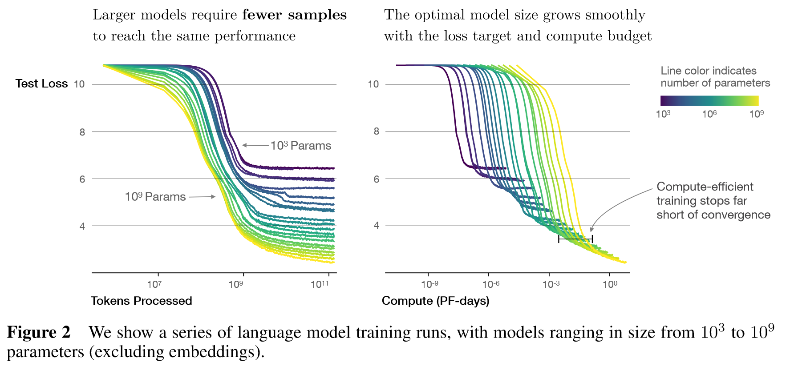
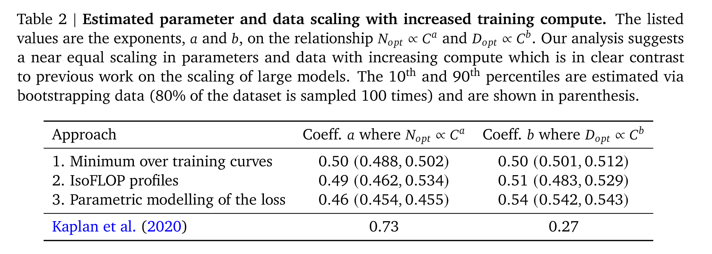
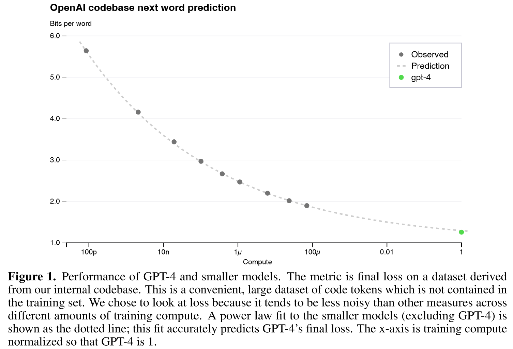
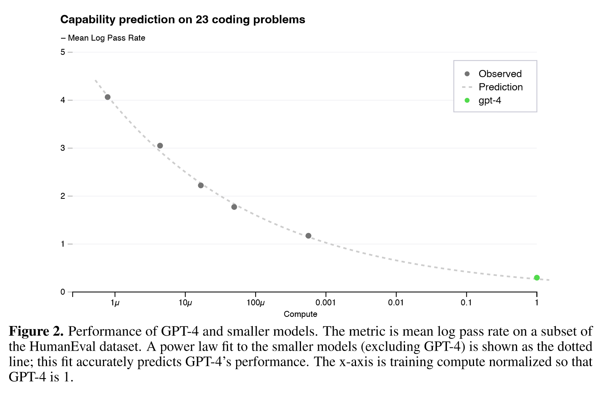
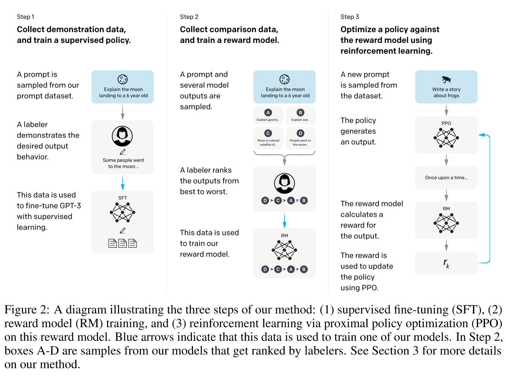
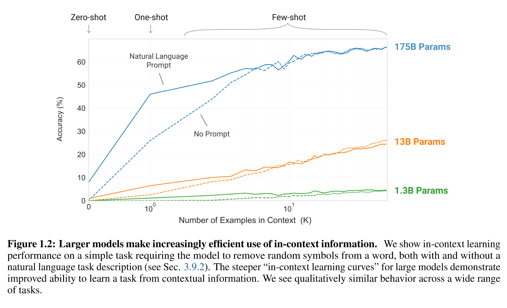
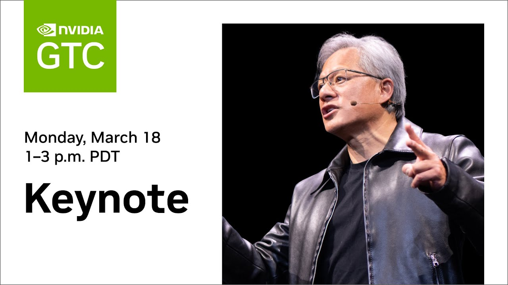

# 【论文导读】大语言模型综述（二）：大语言模型的背景的GPT系列的技术发展历程


## Info

### 上篇

```markdown
**视频简介** 
本系列为《A Survey of Large Language Model》的论文导读系列视频，本视频导读内容为论文的第二章的前半部分，即第二章Overview下的2.1 Background for LLMs。
本次介绍内容主要包括"尺度效应"(Scaling Law)、"涌现能力"(Emergent Abilities)和大语言模型的重要技术概念。  
论文引用：W. X. Zhao et al., ‘A Survey of Large Language Models’. arXiv, Nov. 24, 2023. doi: 10.48550/arXiv.2303.18223.  
拓展阅读：
Kaplan, J., McCandlish, S., Henighan, T., Brown, T. B., Chess, B., Child, R., Gray, S., Radford, A., Wu, J., & Amodei, D. (2020). Scaling Laws for Neural Language Models. ArXiv. https://www.semanticscholar.org/paper/Scaling-Laws-for-Neural-Language-Models-Kaplan-McCandlish/e6c561d02500b2596a230b341a8eb8b921ca5bf2
Hoffmann, J., Borgeaud, S., Mensch, A., Buchatskaya, E., Cai, T., Rutherford, E., Casas, D. de L., Hendricks, L. A., Welbl, J., Clark, A., Hennigan, T., Noland, E., Millican, K., Driessche, G. van den, Damoc, B., Guy, A., Osindero, S., Simonyan, K., Elsen, E., … Sifre, L. (2022). Training Compute-Optimal Large Language Models (arXiv:2203.15556). arXiv. https://doi.org/10.48550/arXiv.2203.15556
OpenAI, Achiam, J., Adler, S., Agarwal, S., Ahmad, L., Akkaya, I., Aleman, F. L., Almeida, D., Altenschmidt, J., Altman, S., Anadkat, S., Avila, R., Babuschkin, I., Balaji, S., Balcom, V., Baltescu, P., Bao, H., Bavarian, M., Belgum, J., … Zoph, B. (2024). GPT-4 Technical Report (arXiv:2303.08774). arXiv. https://doi.org/10.48550/arXiv.2303.08774
Ouyang, L., Wu, J., Jiang, X., Almeida, D., Wainwright, C. L., Mishkin, P., Zhang, C., Agarwal, S., Slama, K., Ray, A., Schulman, J., Hilton, J., Kelton, F., Miller, L., Simens, M., Askell, A., Welinder, P., Christiano, P., Leike, J., & Lowe, R. (2022). Training language models to follow instructions with human feedback (arXiv:2203.02155). arXiv. https://doi.org/10.48550/arXiv.2203.02155
Hendrycks, D., Burns, C., Basart, S., Zou, A., Mazeika, M., Song, D., & Steinhardt, J. (2021). Measuring Massive Multitask Language Understanding (arXiv:2009.03300). arXiv. https://doi.org/10.48550/arXiv.2009.03300
笔记注记：
黄色：名词组分
粉色：动词组分
绿色：状语和修饰语组分
橙色：专有名词
紫色：扩展阅读链接
视频内容/字幕勘误：  
无
```

## 下篇

```markdown
**视频简介** 
本系列为《A Survey of Large Language Model》的论文导读系列视频，本视频导读内容为论文的第二章的后半部分，即第二章Overview下的2.2 Technical Evolution of GPT-series Models。
本次介绍内容主要介绍了OpenAI基于GPT系列模型开发的技术探索历程和重要实践经验。  
论文引用：W. X. Zhao et al., ‘A Survey of Large Language Models’. arXiv, Nov. 24, 2023. doi: 10.48550/arXiv.2303.18223.  
笔记注记：
黄色：名词组分
粉色：动词组分
绿色：状语和修饰语组分
橙色：专有名词
紫色：扩展阅读链接
视频内容/字幕勘误：  
无
```


## Further Reading

### Scaling Law

“KM scaling law.” (Kaplan et al., 2020, page 4)



“Chinchilla scaling law” (Hoffmann et al., 2022, page 8)



> Kaplan, J., McCandlish, S., Henighan, T., Brown, T. B., Chess, B., Child, R., Gray, S., Radford, A., Wu, J., & Amodei, D. (2020). Scaling Laws for Neural Language Models. *ArXiv*. https://www.semanticscholar.org/paper/Scaling-Laws-for-Neural-Language-Models-Kaplan-McCandlish/e6c561d02500b2596a230b341a8eb8b921ca5bf2
>
> Hoffmann, J., Borgeaud, S., Mensch, A., Buchatskaya, E., Cai, T., Rutherford, E., Casas, D. de L., Hendricks, L. A., Welbl, J., Clark, A., Hennigan, T., Noland, E., Millican, K., Driessche, G. van den, Damoc, B., Guy, A., Osindero, S., Simonyan, K., Elsen, E., … Sifre, L. (2022). *Training Compute-Optimal Large Language Models* (arXiv:2203.15556). arXiv. https://doi.org/10.48550/arXiv.2203.15556

### Scaling Law in GPT-4

“GPT-4 (OpenAI et al., 2024, page 2) has reported that some capabilities (e.g., coding ability) can be accurately predicted via scaling law.” 






> OpenAI, Achiam, J., Adler, S., Agarwal, S., Ahmad, L., Akkaya, I., Aleman, F. L., Almeida, D., Altenschmidt, J., Altman, S., Anadkat, S., Avila, R., Babuschkin, I., Balaji, S., Balcom, V., Baltescu, P., Bao, H., Bavarian, M., Belgum, J., … Zoph, B. (2024). *GPT-4 Technical Report* (arXiv:2303.08774). arXiv. https://doi.org/10.48550/arXiv.2303.08774

### RLHF in InstructGPT

“reinforcement learning with human feedback” (Ouyang et al., 2022, page 3)



> Ouyang, L., Wu, J., Jiang, X., Almeida, D., Wainwright, C. L., Mishkin, P., Zhang, C., Agarwal, S., Slama, K., Ray, A., Schulman, J., Hilton, J., Kelton, F., Miller, L., Simens, M., Askell, A., Welinder, P., Christiano, P., Leike, J., & Lowe, R. (2022). *Training language models to follow instructions with human feedback* (arXiv:2203.02155). arXiv. https://doi.org/10.48550/arXiv.2203.02155

### Interview with OpenAI (former)Chief Scientist

[“What the neural network learns is some representation of the process that produced the text. This text is actually a projection of the world...the more accurate you are in predicting the next word, the higher the fidelity, the more resolution you get in this process...”](https://lifearchitect.ai/ilya/)[ ](https://lifearchitect.ai/ilya/)<sup>1</sup>

> 1. https://lifearchitect.ai/ilya/

### "Language models are few-shot learners" from GPT-3



> Brown, T. B., Mann, B., Ryder, N., Subbiah, M., Kaplan, J., Dhariwal, P., Neelakantan, A., Shyam, P., Sastry, G., Askell, A., Agarwal, S., Herbert-Voss, A., Krueger, G., Henighan, T., Child, R., Ramesh, A., Ziegler, D. M., Wu, J., Winter, C., … Amodei, D. (2020). Language Models are Few-Shot Learners. *ArXiv*. https://www.semanticscholar.org/paper/Language-Models-are-Few-Shot-Learners-Brown-Mann/90abbc2cf38462b954ae1b772fac9532e2ccd8b0

### OpenAI API & Model & Pricing 

> https://openai.com/api/pricing/
>
> https://platform.openai.com/docs/models/

### [Transforming AI | NVIDIA GTC 2024 Panel Hosted by Jensen Huang](https://www.youtube.com/watch?v=Y2F8yisiS6E&list=PLZHnYvH1qtOYPPHRaHf9yPQkIcGpIUpdL)


