# 【序】[LLM综述论文](http://arxiv.org/abs/2303.18223)导读第0篇（标题待定）

> This documentation is mainly referred to `W. X. Zhao et al., ‘A Survey of Large Language Models’. arXiv, Nov. 24, 2023. doi: 10.48550/arXiv.2303.18223.`

> 说明:此文档为本视频的主要材料来源和文案参考

视频相关

> 总合集标题：LLM综述论文精读  
> 此视频标题（参考）  
>
> 1. 五分钟了解大模型
> 2. 一个视频带你读懂大模型的前世今生
> 3. 2024年了，我不允许还有人不知道大模型
> 4. 终于有人把大语言模型讲清楚了

---

## ChatGPT: A Sensation

> Chatbot vs. ChatGPT1

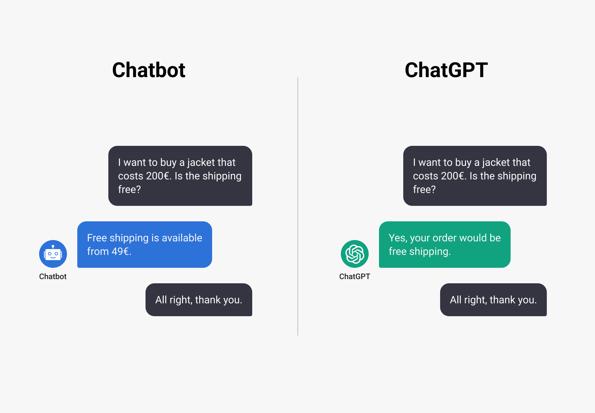

> 1. <https://micoope.com.gt/?o=chatgpt-the-tech-behind-the-hype-and-what-it-nn-n7AYnRsk>

> Fastest Ever User Growth1,2

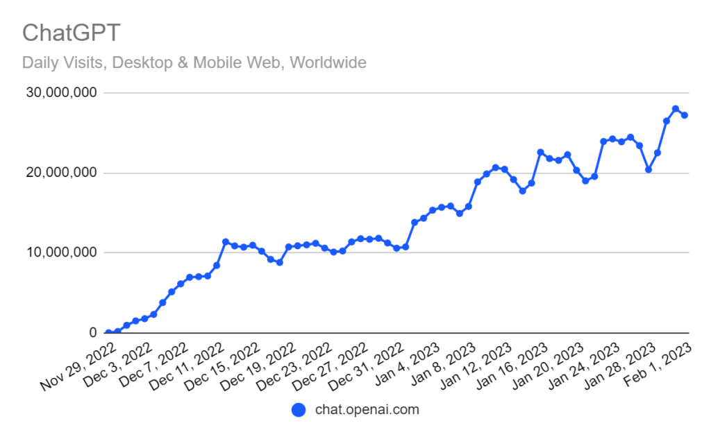

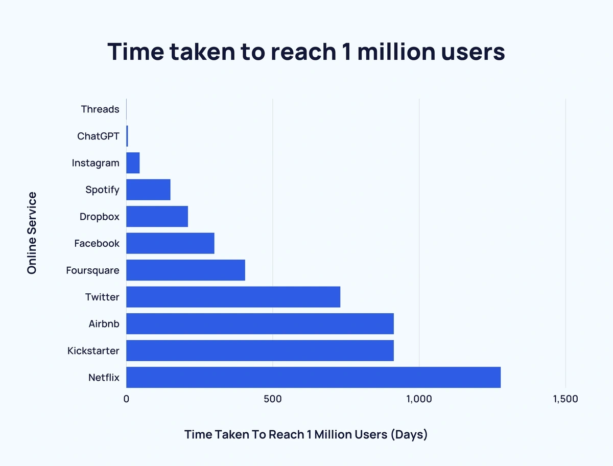

> 1. <https://influencermarketinghub.com/ai-marketing-benchmark-report>  
> 2. <https://explodingtopics.com/blog/chatgpt-users>

## Questions

- What is Large Language Models(LLMs)?
- Why are LLMs important?
- How can we utilize LLMs?

---

## Language Model (LM)

> Introduction to Language Model

`Language modeling` (LM) is one of the major approaches to advancing language intelligence of machines. In general, LM aims to model the generative likelihood of word sequences, so as to predict the probabilities of future (or missing) tokens.

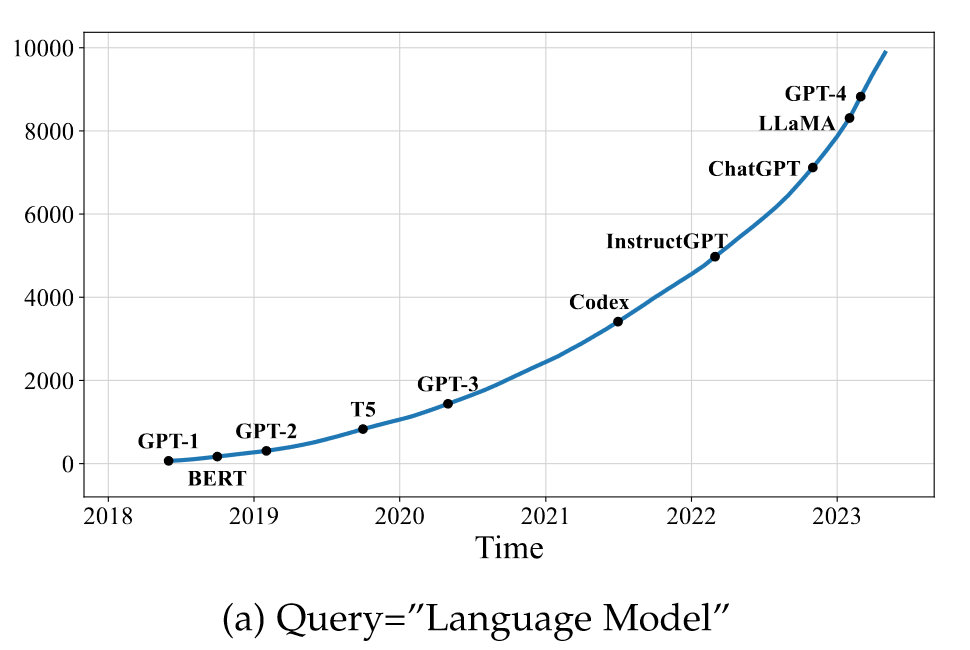

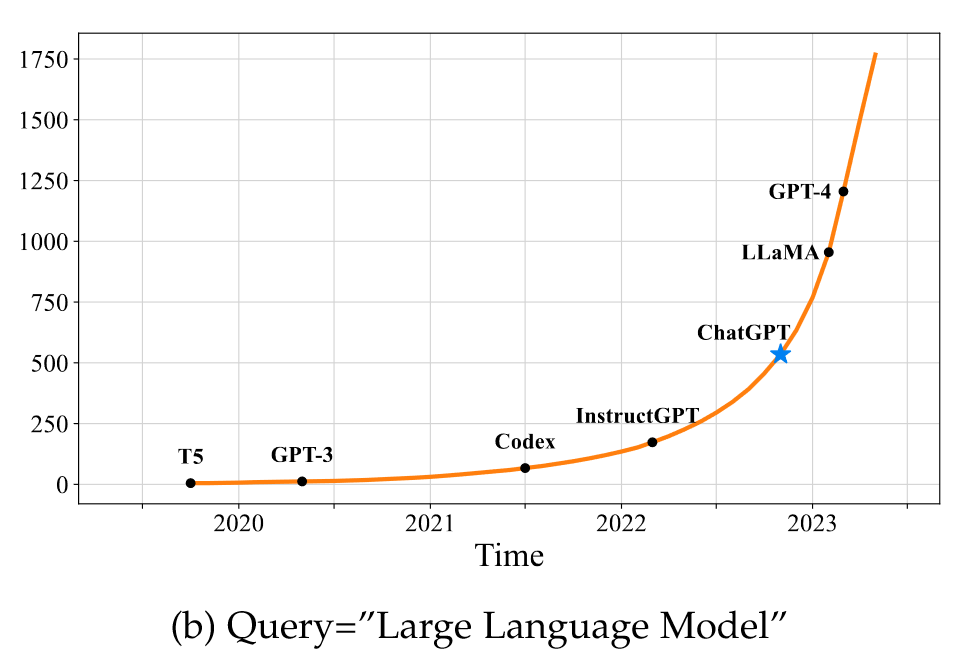

Figure. The trends of the cumulative numbers of arXiv papers that contain the keyphrases “language model” (since June 2018) and “large language model” (since October 2019), respectively. The statistics are calculated using exact match by querying the keyphrases in title or abstract by months. We set different x-axis ranges for the two keyphrases, because “language models” have been explored at an earlier time. We label the points corresponding to important landmarks in the research progress of LLMs. A sharp increase occurs after the release of ChatGPT: the average number of published arXiv papers that contain “large language model” in title or abstract goes from 0.40 per day to 8.58 per day (Figure (b)).

## A Story from LM to `Large` LM

> Timeline of Language Model Development

Statistical language models (SLM)→  
Neural language models (NLM)→  
Pre-trained Language Models (PLM)→  
Large Language Models(LLM,denoted as PLM+)

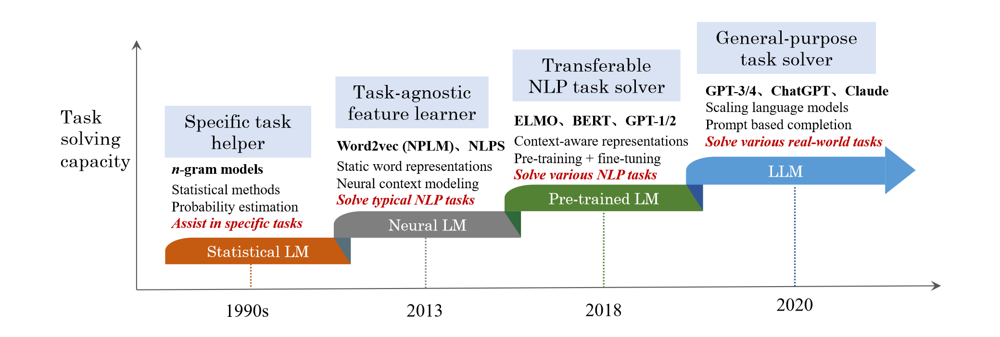

Figure. An evolution process of the four generations of language models (LM) from the perspective of task solving capacity. Note that the time period for each stage may not be very accurate, and we set the time mainly according to the publish date of the most representative studies at each stage. For neural language models, we abbreviate the paper titles of two representative studies to name the two approaches: NPLM [[1](https://jmlr.csail.mit.edu/papers/v3/bengio03a.html)] (“A neural probabilistic language model”) and NLPS [[2]()] (“Natural language processing (almost) from scratch”). Due to the space limitation, we don’t list all representative studies in this figure.

## LLM by Definition

> LLM: Large-sized PLM

Researchers find that scaling PLM (e.g., scaling model size or data size) often leads to an improved model capacity on downstream tasks (i.e., following the scaling law [3]). A number of studies have explored the performance limit by training an ever larger PLM (e.g., the 175B-parameter GPT-3 and the 540B parameter PaLM). Although scaling is mainly conducted in model size (with similar architectures and pre-training tasks), these large-sized PLMs display different behaviors from smaller PLMs (e.g., 330M-parameter BERT and 1.5B parameter GPT-2) and show *surprising* abilities (called **emergent abilities** [4]) in solving a series of complex tasks. For example, GPT-3 can solve few-shot tasks through in-context learning, whereas GPT-2 cannot do well. Thus, the research community coins the term **large language models (LLM)**1 for <u>these large-sized PLMs</u> [5–8], which attract increasing research attention. A remarkable application of LLMs is ChatGPT2 that adapts the LLMs from the GPT series for dialogue, which presents an amazing conversation ability with humans.

> 1. Note that a LLM is not necessarily more capable than a small PLM, and emergent abilities may not occur in some LLMs.
>
---

## An Overview on LLM Market

> Common LLM Products

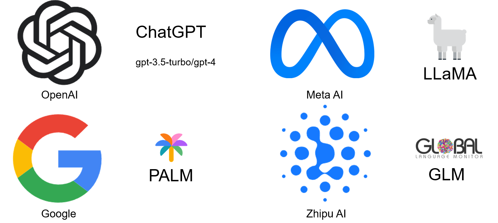

Mainstream LLM with their AI companies

## LLM: A Path for AGI

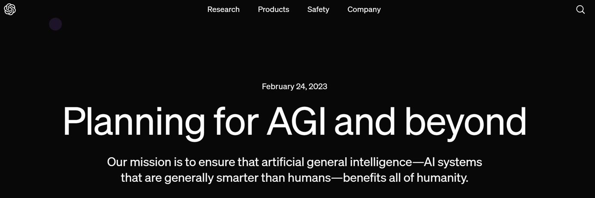

- We can imagine a world in which humanity flourishes to a degree that is probably impossible for any of us to fully visualize yet.
- We hope to contribute to the world an AGI aligned with such flourishing.1

> 1. <https://openai.com/index/planning-for-agi-and-beyond?ref=hir.harvard.edu>

---

## Guidance for AI Green-hands/Researchers

> Choose Your Favorite LLM Projects in [GitHub](https://www.github.com)

<picture>
<source media="(prefers-color-scheme: dark)" srcset="./assets/Lesson_0/llm_universe_stars.svg">
<source media="(prefers-color-scheme: light)" srcset="./assets/Lesson_0/llm_universe_stars.svg">
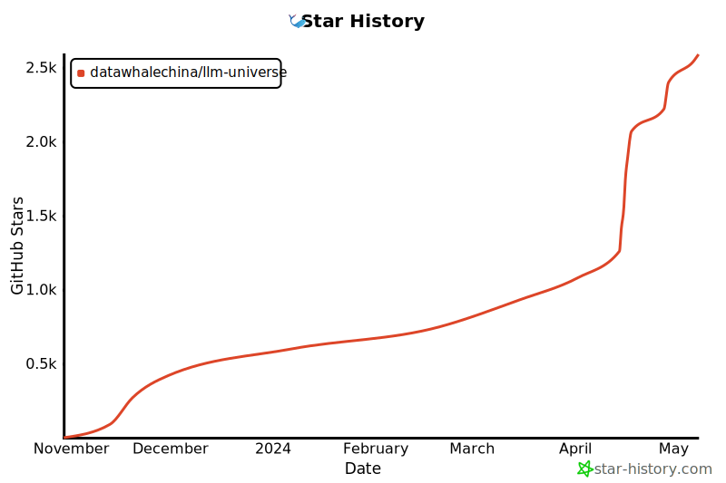
</picture>

项目简介

本项目是一个面向小白开发者的大模型应用开发教程，旨在基于阿里云服务器，结合个人知识库助手项目，通过一个课程完成大模型开发的重点入门，主要内容包括：

<ol>
<li>大模型简介，何为大模型、大模型特点是什么、LangChain 是什么，如何开发一个 LLM 应用，针对小白开发者的简单介绍；</li>
<li>如何调用大模型 API，本节介绍了国内外知名大模型产品 API 的多种调用方式，包括调用原生 API、封装为 LangChain LLM、封装为 Fastapi 等调用方式，同时将包括百度文心、讯飞星火、智谱AI等多种大模型 API 进行了统一形式封装；</li>
<li>知识库搭建，不同类型知识库文档的加载、处理，向量数据库的搭建；</li>
<li>构建 RAG 应用，包括将 LLM 接入到 LangChain 构建检索问答链，使用 Streamlit 进行应用部署</li>
<li>验证迭代，大模型开发如何实现验证迭代，一般的评估方法有什么；</li>
</ol>

本项目主要包括三部分内容：

<ol>
<li>LLM 开发入门。V1 版本的简化版，旨在帮助初学者最快、最便捷地入门 LLM 开发，理解 LLM 开发的一般流程，可以搭建出一个简单的 Demo。</li>
<li>LLM 开发技巧。LLM 开发更进阶的技巧，包括但不限于：Prompt Engineering、多类型源数据的处理、优化检索、召回精排、Agent 框架等</li>
<li>LLM 应用实例。引入一些成功的开源案例，从本课程的角度出发，解析这些应用范例的 Idea、核心思路、实现框架，帮助初学者明白其可以通过 LLM 开发什么样的应用。</li>
</ol>

目前，第一部分已经完稿，欢迎大家阅读学习；第二、三部分正在创作中.

> How to Deploy a Personalized LLM

Python Packages: [LangChain](https://www.langchain.com/) | [LlamaIndex](https://www.llamaindex.ai/)

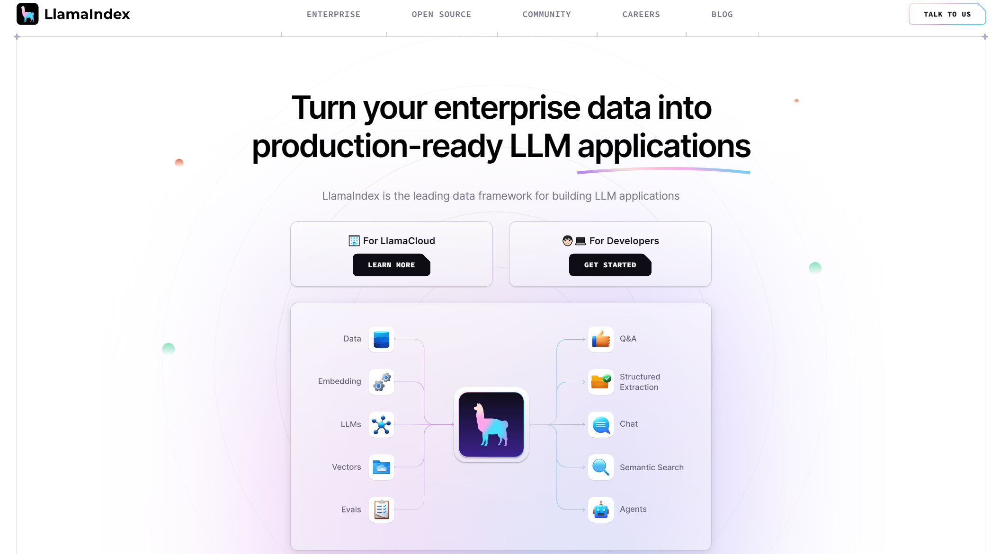

Software Application: [Ollama](https://ollama.com/)

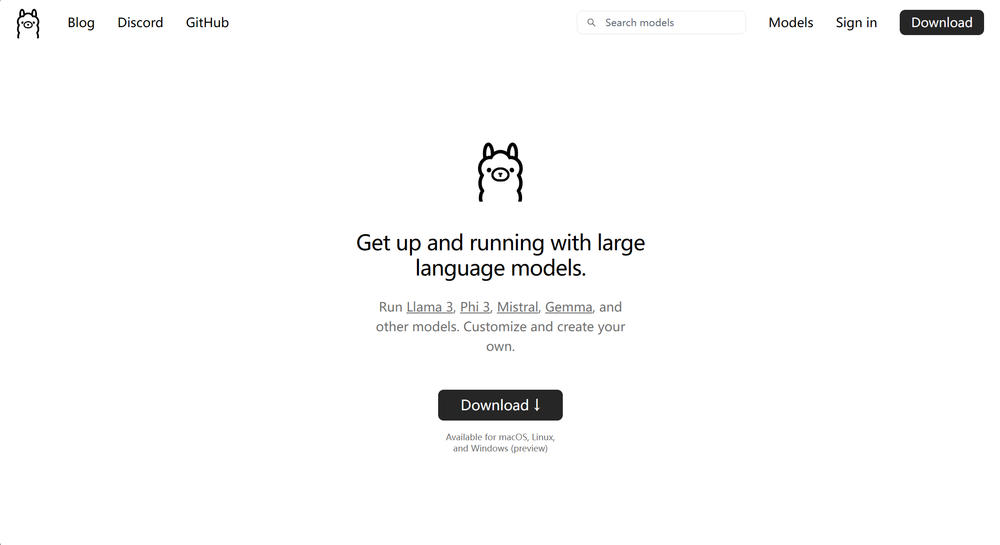

> User-friendly LLM-based Chatbot Project

## Summary

> Recall the three Questions

- What is Large Language Models?

- Why are LLMs important?

- How can we utilize LLMs?

---

## References

> First Survey on LLM

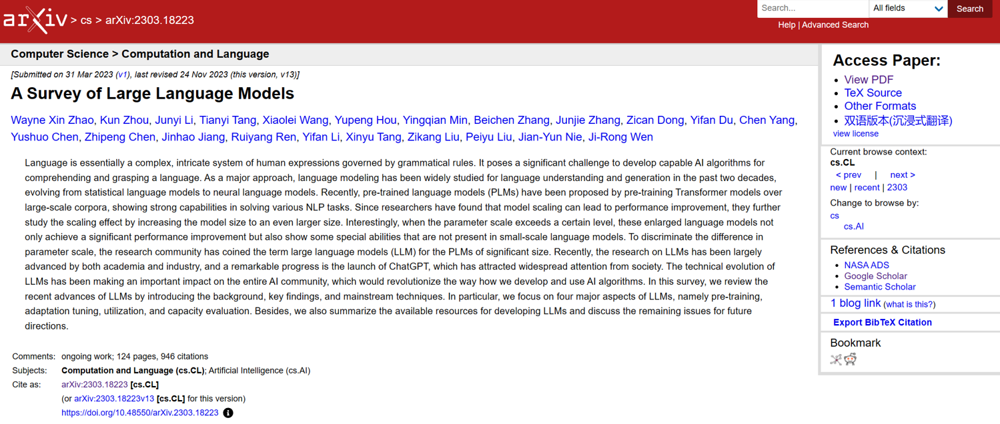

[1] Y. Bengio, R. Ducharme, P. Vincent, and C. Janvin, “A neural probabilistic language model,” J. Mach. Learn. Res., vol. 3, pp. 1137–1155, 2003.  
[2] R. Collobert, J. Weston, L. Bottou, M. Karlen, K. Kavukcuoglu, and P. P. Kuksa, “Natural language processing (almost) from scratch,” J. Mach. Learn. Res., vol. 12, pp. 2493–2537, 2011.  
[3] J. Kaplan, S. McCandlish, T. Henighan, T. B. Brown, B. Chess, R. Child, S. Gray, A. Radford, J. Wu, and D. Amodei, “Scaling laws for neural language models,” CoRR, vol. abs/2001.08361, 2020.  
[4] J. Wei, Y. Tay, R. Bommasani, C. Raffel, B. Zoph, S. Borgeaud, D. Yogatama, M. Bosma, D. Zhou, D. Metzler, E. H. Chi, T. Hashimoto, O. Vinyals, P. Liang, J. Dean, and W. Fedus, “Emergent abilities of large language models,” CoRR, vol. abs/2206.07682, 2022.  
[5] M. Shanahan, “Talking about large language models,” CoRR, vol. abs/2212.03551, 2022.  
[6] J. Wei, X. Wang, D. Schuurmans, M. Bosma, E. H. Chi, Q. Le, and D. Zhou, “Chain of thought prompting elicits reasoning in large language models,” CoRR, vol. abs/2201.11903, 2022.  
[7] J. Hoffmann, S. Borgeaud, A. Mensch, E. Buchatskaya, T. Cai, E. Rutherford, D. de Las Casas, L. A. Hendricks, J. Welbl, A. Clark, T. Hennigan, E. Noland, K. Millican, G. van den Driessche, B. Damoc, A. Guy, S. Osindero, K. Simonyan, E. Elsen, J. W. Rae, O. Vinyals, and L. Sifre, “Training compute-optimal large language models,” vol. abs/2203.15556, 2022.  
[8] R. Taylor, M. Kardas, G. Cucurull, T. Scialom, A. Hartshorn, E. Saravia, A. Poulton, V. Kerkez, and R. Stojnic, “Galactica: A large language model for science,” CoRR, vol. abs/2211.09085, 2022.  
