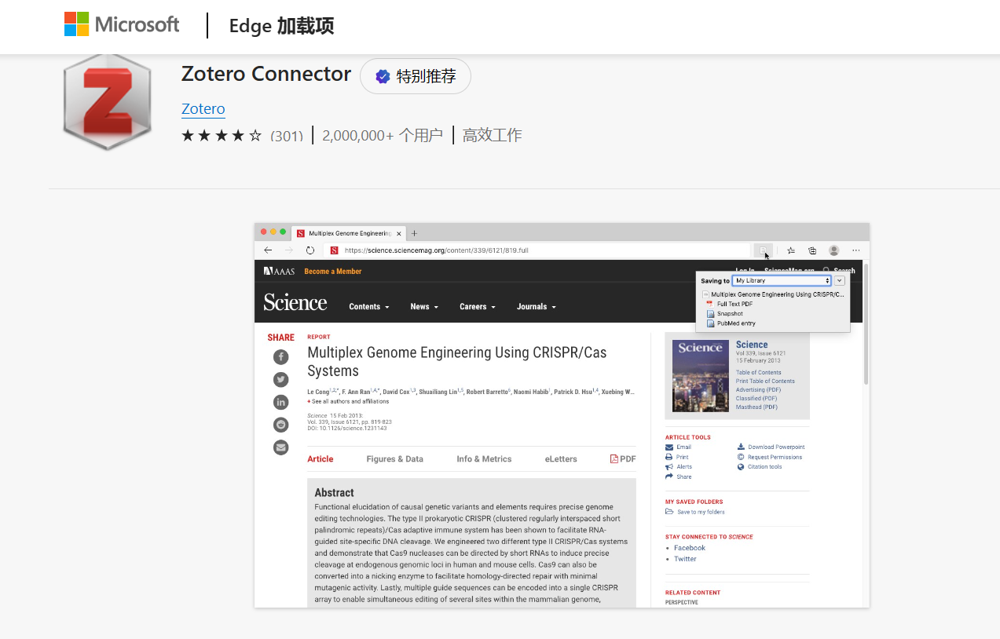
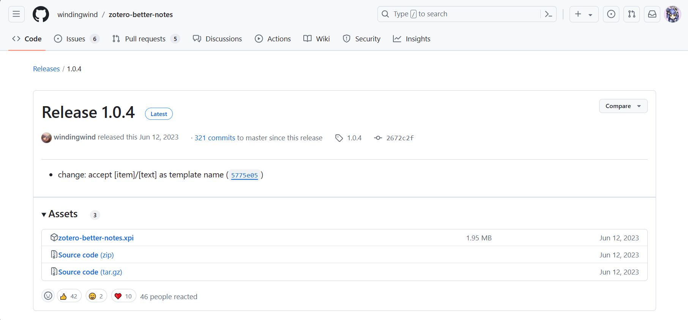
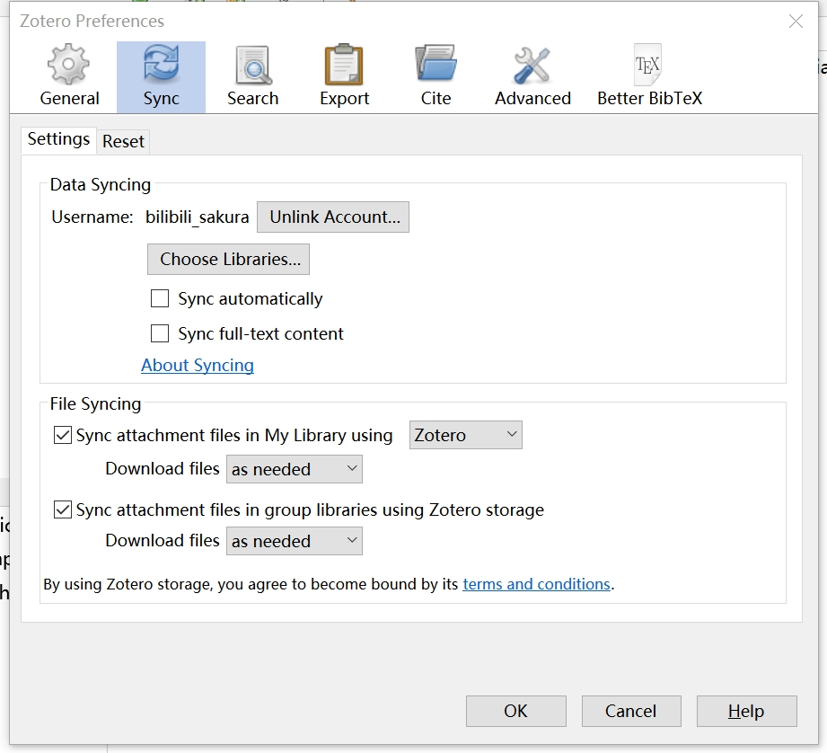

# 【序】Zotero介绍

> Author: Sakura (Bilibili@Sa神带你学AI）
>
> Last Updated: May 15, 2024

## 什么是 [Zotero](https://www.zotero.org/)

> **Zotero** is a free, easy-to-use tool to help you <u>collect, organize, annotate, cite, and share research</u>.

Zotero是一款用于收集、管理、注记、引用和协作的文献管理工具。

Figure. Overview of Zotero

Figure. Preview of Zotero

## 为什么选择 [Zotero](https://www.zotero.org/)

- [免费 & 开源](https://www.zotero.org/why/)

| Storage Limit | Individual Pricing Cost (USD) |
|---------------|------------------------------|
| 300 MB        | Free                         |
| 2 GB          | $20/year (equal to $1.67 per month) |
| 6 GB          | $60/year (equal to $5 per month)   |
| Unlimited     | $120/year (equal to $10 per month) |

- [一键式文献下载](https://www.zotero.org/download/)

Figure. Zotero Connector Official Released Add-ons in Microsoft Store

- [丰富插件支持](https://www.zotero.org/support/plugins/)

> To install a plugin in Zotero, download its .xpi file to your computer. Then, in Zotero, click “Tools → Add-ons” and drag the .xpi onto the Add-ons window.

要在Zotero中安装插件，首先将其 .xpi 文件下载到您的计算机上。然后，在 Zotero 中，点击 “工具 → 插件” 并将 .xpi 文件拖放到插件窗口中。

Figure. Released Package of Zotero Plugins (e.g."zotero-better-notes")

- [跨平台数据同步](https://www.zotero.org/storage/)

Figure. Zotero Account

## 拓展阅读

[Zotero | Why Zotero?](https://www.zotero.org/why/)

[Zotero Documentation](https://www.zotero.org/support/)
