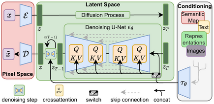

# Diffusion Model

> This Document is mostly referred to [扩散模型 - 维基百科，自由的百科全书 --- Diffusion model - Wikipedia](https://en.wikipedia.org/wiki/Diffusion_model)

## Introduction

In machine learning, **diffusion models**, also known as **diffusion probabilistic models** or **score-based generative models**, are a class of <u>latent variable generative</u> models.

In the case of computer vision, diffusion models can be applied to a variety of tasks, including image denoising, inpainting, super-resolution, and image generation.

Diffusion models have recently found applications in natural language processing (NLP), particularly in areas like text generation and summarization. (Han et al., 2023; Li et al., 2023; Xu et al., 2023; Zhang et al., 2023)

## Denoising diffusion model

### Non-equilibrium thermodynamics

Diffusion models were introduced in 2015 as a method to learn a model that can sample from a highly complex probability distribution. They used techniques from non-equilibrium thermodynamics, especially diffusion.(Sohl-Dickstein et al., n.d.)

The randomness is necessary: if the particles were to undergo only gradient descent, then they will all fall to the origin, collapsing the distribution.

### Denoising Diffusion Probabilistic Model (DDPM)

The 2020 paper proposed the Denoising Diffusion Probabilistic Model (DDPM), which improves upon the previous method by variational inference. (Ho et al., 2020)

### Score-based generative model

Score-based generative model is another formulation of diffusion modelling. They are also called noise conditional score network (NCSN) or score-matching with Langevin dynamics (SMLD). (Song et al., 2021)

## Choice of architecture

### Diffusion model

Architecture of Stable Diffusion

The denoising process used by Stable Diffusion

The U-Net, which was found to be good for denoising images, is often used for denoising diffusion models that generate images. (Ho et al., 2022)

## Conditioning

Stable Diffusion, for example, imposes conditioning in the form of cross-attention mechanism, where the query is an intermediate representation of the image in the U-Net, and both key and value are the conditioning vectors. The conditioning can be selectively applied to only parts of an image, and new kinds of conditionings can be finetuned upon t he base model, as used in ControlNet. (Zhang et al., 2023)

### Upscaling

As generating an image takes a long time, one can try to generate a small image by a base diffusion model, then upscale it by other models. Upscaling can be done by GAN, Transformer, or signal processing methods like Lanczos resampling. (Liang et al., 2021; Wang et al., 2021)

## Examples

### OpenAI

(Nichol et al., 2022; Ramesh et al., 2022)

The DALL-E series by OpenAI are text-conditional diffusion models of images.

The first version of DALL-E (2021) is not actually a diffusion model. Instead, it uses a Transformer architecture that generates a sequence of tokens, which is then converted to an image by the decoder of a discrete VAE. Released with DALL-E was the CLIP classifier, which was used by DALL-E to rank generated images according to how close the image fits the text.

GLIDE (2022-03) is a 3.5-billion diffusion model, and a small version was released publicly. Soon after, DALL-E 2 was released (2022-04).  DALL-E 2 is a 3.5-billion cascaded diffusion model that generates images from text by "inverting the CLIP image encoder", the technique which they termed "unCLIP".

Sora (2024-02) is a diffusion Transformer model (DiT).

### Stability AI

Stable Diffusion (2022-08), released by Stability AI, consists of a denoising latent diffusion model (860 million parameters), a VAE, and a text encoder. The denoising network is a U-Net, with cross-attention blocks to allow for conditional image generation. Stable Diffusion 3 (2024-02)changed the latent diffusion model from the UNet to a Transformer model, and so it is a DiT. It uses rectified flow.(Esser et al., 2024; Rombach et al., 2022)

### Google Imagen

Imagen (2022-05) uses a T5 language emodel to encode the input text into embeddings. It is a cascaded diffusion model with three steps. The first step denoises a white noise to a 64×64 image, conditional on text embedding. The second step upscales the image by 64×64→256× 256, conditional on text embedding. The third step is similar, upscaling by 256×256→1024× 1024. The three denoising networks are all U-Nets. Imagen 2 (2023-12) is also diffusion-based. It can generate images based on a prompt that mixes images and text. No further information available. (Saharia et al., 2022)

## References

- Esser, P., Kulal, S., Blattmann, A., Entezari, R., Müller, J., Saini, H., Levi, Y., Lorenz, D., Sauer, A., Boesel, F., Podell, D., Dockhorn, T., English, Z., Lacey, K., Goodwin, A., Marek, Y., & Rombach, R. (2024). Scaling Rectified Flow Transformers for High-Resolution Image Synthesis (arXiv:2403.03206). arXiv. <https://doi.org/10.48550/arXiv.2403.03206>
- Han, X., Kumar, S., & Tsvetkov, Y. (2023). *SSD-LM: Semi-autoregressive Simplex-based Diffusion Language Model for Text Generation and Modular Control* (arXiv:2210.17432). arXiv. <https://doi.org/10.48550/arXiv.2210.17432>
- Ho, J., Saharia, C., Chan, W., Fleet, D. J., Norouzi, M., & Salimans, T. (2022). Cascaded diffusion models for high fidelity image generation. The Journal of Machine Learning Research, 23(1), 47:2249-47:2281.
- Li, Y., Zhou, K., Zhao, W. X., & Wen, J.-R. (2023). *Diffusion Models for Non-autoregressive Text Generation: A Survey*. *6*, 6692–6701. <https://doi.org/10.24963/ijcai.2023/750>
- Liang, J., Cao, J., Sun, G., Zhang, K., Van Gool, L., & Timofte, R. (2021). SwinIR: Image Restoration Using Swin Transformer (arXiv:2108.10257; Version 1). arXiv. <https://doi.org/10.48550/arXiv.2108.10257>
- Nichol, A., Dhariwal, P., Ramesh, A., Shyam, P., Mishkin, P., McGrew, B., Sutskever, I., & Chen, M. (2022). GLIDE: Towards Photorealistic Image Generation and Editing with Text-Guided Diffusion Models (arXiv:2112.10741). arXiv. <https://doi.org/10.48550/arXiv.2112.10741>
- Ramesh, A., Dhariwal, P., Nichol, A., Chu, C., & Chen, M. (2022). Hierarchical Text-Conditional Image Generation with CLIP Latents (arXiv:2204.06125). arXiv. <https://doi.org/10.48550/arXiv.2204.06125>
- Rombach, R., Blattmann, A., Lorenz, D., Esser, P., & Ommer, B. (2022). High-Resolution Image Synthesis with Latent Diffusion Models (arXiv:2112.10752). arXiv. <https://doi.org/10.48550/arXiv.2112.10752>
- Saharia, C., Chan, W., Saxena, S., Li, L., Whang, J., Denton, E. L., Ghasemipour, K., Gontijo Lopes, R., Karagol Ayan, B., Salimans, T., Ho, J., Fleet, D. J., & Norouzi, M. (2022). Photorealistic Text-to-Image Diffusion Models with Deep Language Understanding. *Advances in Neural Information Processing Systems*, *35*, 36479–36494. <https://proceedings.neurips.cc/paper_files/paper/2022/hash/ec795aeadae0b7d230fa35cbaf04c041-Abstract-Conference.html>
- Sohl-Dickstein, J., Weiss, E. A., Maheswaranathan, N., & Ganguli, S. (n.d.). Deep Unsupervised Learning using Nonequilibrium Thermodynamics.
- Song, Y., Sohl-Dickstein, J., Kingma, D. P., Kumar, A., Ermon, S., & Poole, B. (2021). Score-Based Generative Modeling through Stochastic Differential Equations (arXiv:2011.13456). arXiv. <https://doi.org/10.48550/arXiv.2011.13456>
- Wang, X., Xie, L., Dong, C., & Shan, Y. (2021). Real-ESRGAN: Training Real-World Blind Super-Resolution with Pure Synthetic Data (arXiv:2107.10833). arXiv. <https://doi.org/10.48550/arXiv.2107.10833>
- Xu, W., Hu, W., Wu, F., & Sengamedu, S. (2023). DeTiME: Diffusion-Enhanced Topic Modeling using Encoder-decoder based LLM. In H. Bouamor, J. Pino, & K. Bali (Eds.), *Findings of the Association for Computational Linguistics: EMNLP 2023* (pp. 9040–9057). Association for Computational Linguistics. <https://doi.org/10.18653/v1/2023.findings-emnlp.606>
- Zhang, H., Liu, X., & Zhang, J. (2023). DiffuSum: Generation Enhanced Extractive Summarization with Diffusion. In A. Rogers, J. Boyd-Graber, & N. Okazaki (Eds.), *Findings of the Association for Computational Linguistics: ACL 2023* (pp. 13089–13100). Association for Computational Linguistics. <https://doi.org/10.18653/v1/2023.findings-acl.828>
- Zhang, L., Rao, A., & Agrawala, M. (2023). Adding Conditional Control to Text-to-Image Diffusion Models. 2023 IEEE/CVF International Conference on Computer Vision (ICCV), 3813–3824. <https://doi.org/10.1109/ICCV51070.2023.00355>
