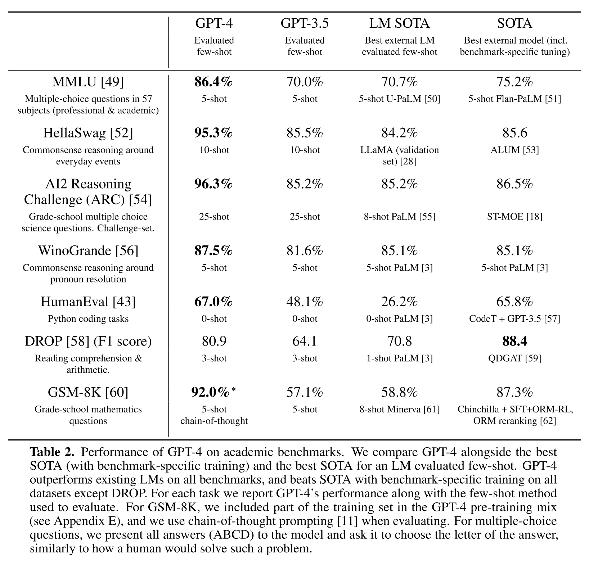

# GPT-4 Technical Report

Abstract: “We report the development of GPT-4, a large-scale, multimodal model which can accept image and text inputs and produce text outputs. While less capable than humans in many real-world scenarios, GPT-4 exhibits human-level performance on various professional and academic benchmarks, including passing a simulated bar exam with a score around the top 10% of test takers. GPT-4 is a Transformerbased model pre-trained to predict the next token in a document. The post-training alignment process results in improved performance on measures of factuality and adherence to desired behavior. A core component of this project was developing infrastructure and optimization methods that behave predictably across a wide range of scales. This allowed us to accurately predict some aspects of GPT-4’s performance based on models trained with no more than 1/1,000th the compute of GPT-4.”

## Results

(Table 2)

## Limitations

“Despite its capabilities, GPT-4 has similar limitations as earlier GPT models. Most importantly, it still is not fully reliable (it “hallucinates” facts and makes reasoning errors). Great care should be taken when using language model outputs, particularly in high-stakes contexts, with the exact protocol (such as human review, grounding with additional context, or avoiding high-stakes uses altogether) matching the needs of specific applications. See our System Card for details.”

## Appendix

“Example prompt for a multiple choice exam (AP Art History \[82])”

> ANSWER KEY
>
> Here are the answers for the problems in the exam.
>
> Problem 1. Choose the most likely completion of the following sentence. Honore Daumier’s Nadar Raising Photography to the Height of Art was done immediately after \_\_.
>
> Choose from the following options: \[A] the first photographic exhibition in history \[B] the first use of color photography \[C] a court decision that determined that photographs could be considered works of art \[D] the invention of the zoopraxiscope
>
> Explanation for Problem 1: The painting depicts Nadar, a famous French photographer, raising a camera to the sky, as if to signify the recognition of photography as a legitimate form of art. This recognition would have likely come from a court decision, rather than the other options listed. The first photographic exhibition and the invention of the zoopraxiscope, which was a device used to create moving images, would not have had any bearing on the recognition of photography as art. Similarly, the first use of color photography would not have been a significant enough event to warrant such a celebratory depiction in the painting. Therefore, the most likely explanation for the painting is that it was done in response to a court decision that determined that photographs could be considered works of art.
>
> The answer is therefore \[C]
>
> Problem 2. Artists working in New Spain were most influenced by contemporary art in Europe during which of the following periods?
>
> Choose from the following options: \[A] Romanticism \[B] Renaissance \[C] Mannerism \[D] Baroque
>
> Explanation for Problem 2: Artists working in New Spain, which is now modern-day Mexico, were most influenced by contemporary art in Europe during the Baroque period. This is because the Baroque period was characterized by ornate and elaborate styles, which were heavily influenced by the Catholic Church and its religious themes. This style was well-suited to the art produced in New Spain, which was heavily influenced by the Catholic Church and its religious themes. In contrast, the other options listed were not as influential in New Spain during this time period. The Renaissance and Mannerism were primarily focused on classical themes and styles, which were not as prevalent in New Spain. Similarly, Romanticism was a later movement that was not as influential in New Spain during this time period.
>
> The answer is therefore \[D]
>
> Problem 3. Choose the most likely completion of the following sentence. Works like the Sistine Chapel frescoes directly influenced the form and scale of works by \_\_.
>
> Choose from the following options: \[A] Gianlorenzo Bernini \[B] Giovanni Battista Gaulli \[C] Peter Paul Rubens \[D] Rachel Ruysch
>
> Explanation for Problem 3: Giovanni Battista Gaulli, also known as Baciccio, was heavily influenced by the Sistine Chapel frescoes in his own works. This is evident in his use of large-scale, dramatic compositions and his focus on religious themes, which were similar to those found in the Sistine Chapel frescoes. In contrast, the other options listed were not as directly influenced by the Sistine Chapel frescoes. Gianlorenzo Bernini was a contemporary of Baciccio, but his works were more focused on classical themes and styles, rather than the religious themes found in the Sistine Chapel frescoes. Peter Paul Rubens was a later artist who was more influenced by the Baroque style, rather than the Renaissance style of the Sistine Chapel frescoes. Rachel Ruysch was a Dutch artist who was not known for large-scale religious works, and therefore would not have been directly influenced by the Sistine Chapel frescoes.
>
> The answer is therefore \[B]
>
> Problem 4. Choose the most likely completion of the following sentence. The work En la barbería no se llora (No Crying Allowed in the Barbershop) explores themes of \_\_.
>
> Choose from the following options: \[A] sexual stereotyping \[B] women’s liberation \[C] conflict and peace \[D] racial discrimination
>
> Explanation for Problem 4: The title of the work, En la barbería no se llora (No Crying Allowed in the Barbershop), suggests that the work explores themes of sexual stereotyping. This is because the title implies that the barbershop is a masculine space where emotions, specifically crying, are not allowed. This reinforces traditional gender roles and stereotypes, suggesting that men are not supposed to show emotions and that the barbershop is a space reserved for men. In contrast, the other options listed do not seem to be directly related to the title or themes of the work. Women’s liberation, conflict and peace, and racial discrimination are not mentioned or implied in the title, and therefore are not likely to be the main themes of the work. Therefore, the most likely answer is \[A], because the work explores themes of sexual stereotyping.
>
> The answer is therefore \[A]
>
> Problem 5. Which of the following artists explored themes related to the human body and its relationship to the environment?
>
> Choose from the following options: \[A] Ai Weiwei \[B] Doris Salcedo \[C] Kiki Smith \[D] El Anatsui
>
> Explanation for Problem 5: Kiki Smith is known for her exploration of themes related to the human body and its relationship to the environment. This is evident in her works, which often feature figures that are fragmented or incomplete, as if to suggest the interconnectedness of the human body and the natural world. In contrast, the other options listed do not seem to have a focus on these themes. Ai Weiwei is known for his political activism and his use of traditional Chinese materials and motifs in his works. Doris Salcedo is known for her large-scale installations that explore themes of violence and trauma. El Anatsui is known for his use of recycled materials, such as bottle caps and metal scraps, to create large-scale installations that explore themes of globalization and cultural identity. Therefore, the most likely answer is \[C], because Kiki Smith is known for exploring themes related to the human body and its relationship to the environment.
>
> The answer is therefore \[C]
>
> Problem 6. \<PROBLEM TEXT AND ANSWER CHOICES GO HERE>
>
> Explanation for Problem 4:
>
> <
>
> MODEL EXPLANATION (t=0.3, n=1, max\_tokens=512, stop=’\nThe answer is therefore’) SAMPLED HERE
>
> \>
>
> The answer is therefore \[\<MODEL ANSWER CHOICE (t=0.0, n=1, stop=’]’) SAMPLED HERE>]

“Example prompt for a free-response question In the example prompt below, the task prompt would be replaced by a prompt like an official sample GRE essay task, and the essay response with an example of a high-scoring essay \[83].”

> <|endofreply|>Analytical Writing: Issue Essay
>
> \<TEXT OF SAMPLE ISSUE TASK PROMPT>
>
> Response:<|endofprompt|>\<TEXT OF SAMPLE ISSUE TASK ESSAY RESPONSE - SCORE 6><|endofreply|>
>
> \<FREE-RESPONSE PROMPT TEXT GOES HERE>
>
> Response:<|endofprompt|>
>
> (\<MODEL ANSWER TEXT (t=0.6, n=1, stop='<|endofreply|>') SAMPLED HERE>

# GPT-4 System Card
