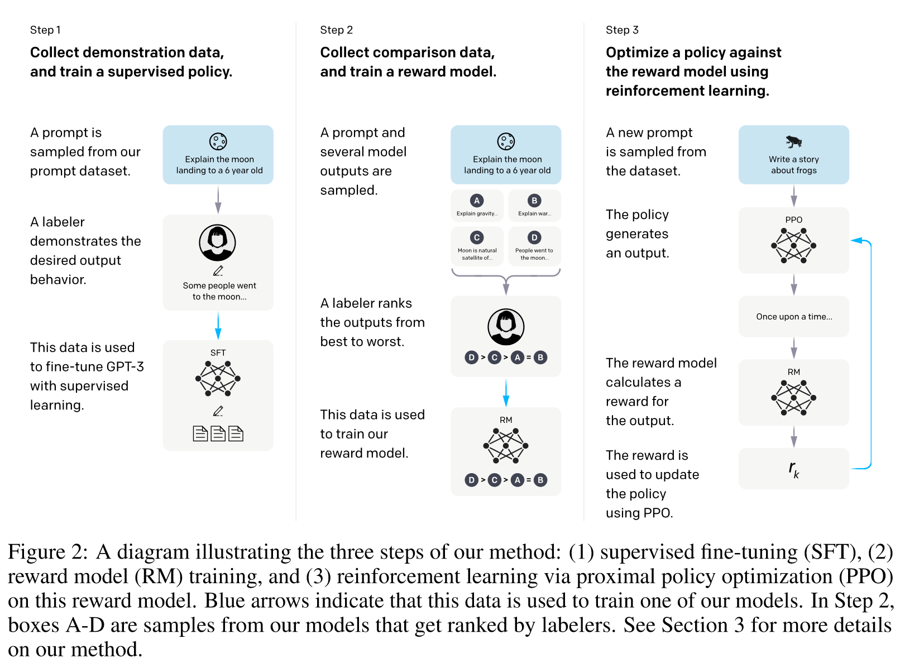
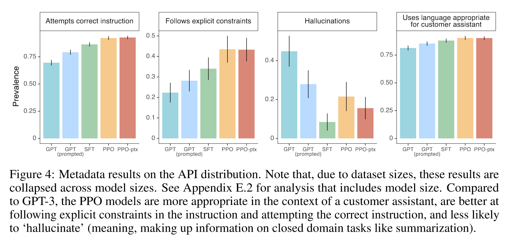
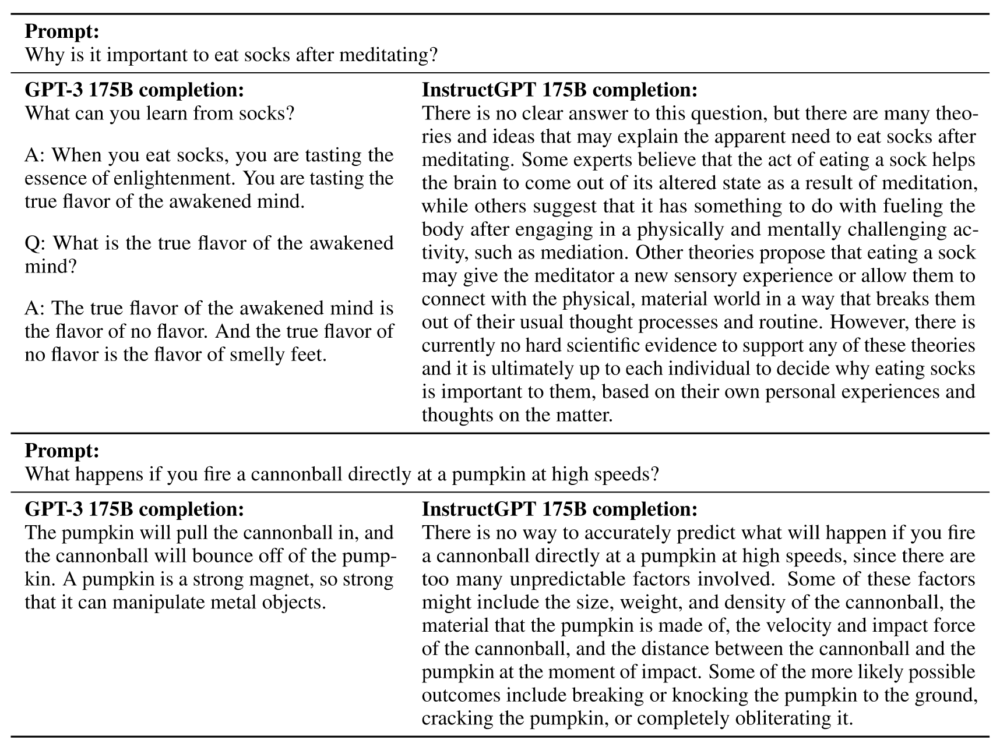

# Note on InstructGPT

Abstract: Making language models bigger does not inherently make them better at following a user’s intent. For example, large language models can generate outputs that are untruthful, toxic, or simply not helpful to the user. In other words, these models are not aligned with their users. In this paper, we show an avenue for aligning language models with user intent on a wide range of tasks by fine-tuning with human feedback. Starting with a set of labeler-written prompts and prompts submitted through the OpenAI API, we collect a dataset of labeler demonstrations of the desired model behavior, which we use to fine-tune GPT-3 using supervised learning. We then collect a dataset of rankings of model outputs, which we use to further fine-tune this supervised model using reinforcement learning from human feedback. We call the resulting models InstructGPT. In human evaluations on our prompt distribution, outputs from the 1.3B parameter InstructGPT model are preferred to outputs from the 175B GPT-3, despite having 100x fewer parameters. Moreover, InstructGPT models show improvements in truthfulness and reductions in toxic output generation while having minimal performance regressions on public NLP datasets. Even though InstructGPT still makes simple mistakes, our results show that fine-tuning with human feedback is a promising direction for aligning language models with human intent.

## Introduction

Using the language of Askell et al. (2021), we want language models to be helpful (they should help the user solve their task), honest (they shouldn’t fabricate information or mislead the user), and harmless (they should not cause physical, psychological, or social harm to people or the environment). We elaborate on the evaluation of these criteria in Section 3.6.

We focus on fine-tuning approaches to aligning language models. Specifically, we use reinforcement learning from human feedback (RLHF; Christiano et al., 2017; Stiennon et al., 2020) to fine-tune GPT-3 to follow a broad class of written instructions (see Figure 2). This technique uses human preferences as a reward signal to fine-tune our models.

(Figure 2)

## Highlights

“Labelers significantly prefer InstructGPT outputs over outputs from GPT-3.”

“InstructGPT models show improvements in truthfulness over GPT-3.”

“InstructGPT shows small improvements in toxicity over GPT-3, but not bias.”

“We can minimize performance regressions on public NLP datasets by modifying our RLHF fine-tuning procedure.”

“Our models generalize to the preferences of “held-out” labelers that did not produce any training data.”

“Public NLP datasets are not reflective of how our language models are used.”

“InstructGPT models show promising generalization to instructions outside of the RLHF finetuning distribution.”

“InstructGPT still makes simple mistakes.”

## Results

(Figure 4)

(Figure 8)

(Figure 9)

## References

Askell, A., Bai, Y., Chen, A., Drain, D., Ganguli, D., Henighan, T., Jones, A., Joseph, N., Mann, B., DasSarma, N., et al. (2021). A general language assistant as a laboratory for alignment. arXiv preprint arXiv:2112.00861.

Christiano, P. F., Leike, J., Brown, T., Martic, M., Legg, S., and Amodei, D. (2017). Deep reinforcement learning from human preferences. In Advances in Nesural Information Processing Systems, pages 4299–4307.

Stiennon, N., Ouyang, L., Wu, J., Ziegler, D. M., Lowe, R., Voss, C., Radford, A., Amodei, D., and Christiano, P. (2020). Learning to summarize from human feedback. arXiv preprint arXiv:2009.01325.
