# Note on LLaMA

## Highlights

### Scaling Laws

The objective of the scaling laws from Hoffmann et al. (2022) is to determine how to best scale the dataset and model sizes for a particular training compute budget.(<a href="zotero://select/library/items/8TPGCK9T">Hoffmann et al., 2022</a>) However, this objective disregards the inference budget, which becomes critical when serving a language model at scale. In this context, given a target level of performance, the preferred model is not the fastest to train but the fastest at inference, and although it may be cheaper to train a large model to reach a certain level of performance, a smaller one trained longer will ultimately be cheaper at inference. For instance, although Hoffmann et al. (2022) recommends training a 10B model on 200B tokens, we find that the performance of a 7B model continues to improve even after 1T tokens.

### LLMs Performances on Massive Multitask Language Understanding(MMLU)

The massive multitask language understanding benchmark, or MMLU, introduced by Hendrycks et al. (2020) consists of multiple choice questions covering various domains of knowledge, including humanities, STEM and social sciences. We evaluate our models in the 5-shot setting, using the examples provided by the benchmark, and report results in Table 9. On this benchmark, we observe that the LLaMA-65B is behind both Chinchilla70B and PaLM-540B by a few percent in average, and across most domains. A potential explanation is that we have used a limited amount of books and academic papers in our pre-training data, i.e., ArXiv, Gutenberg and Books3, that sums up to only 177GB, while these models were trained on up to 2TB of books. This large quantity of books used by Gopher, Chinchilla and PaLM may also explain why Gopher outperforms GPT-3 on this benchmark, while it is comparable on other benchmarks. (<a href="zotero://select/library/items/8Y9Y33EK">Hendrycks et al., 2021</a>)

### Generations from LLaMA-65B

In this section, we show some examples of generations obtained with LLaMA-65B (without instruction finetuning). Prompts are in bold.

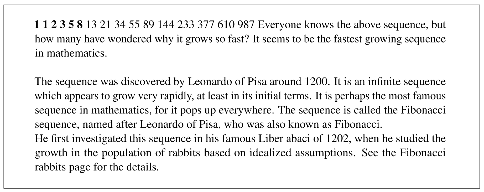

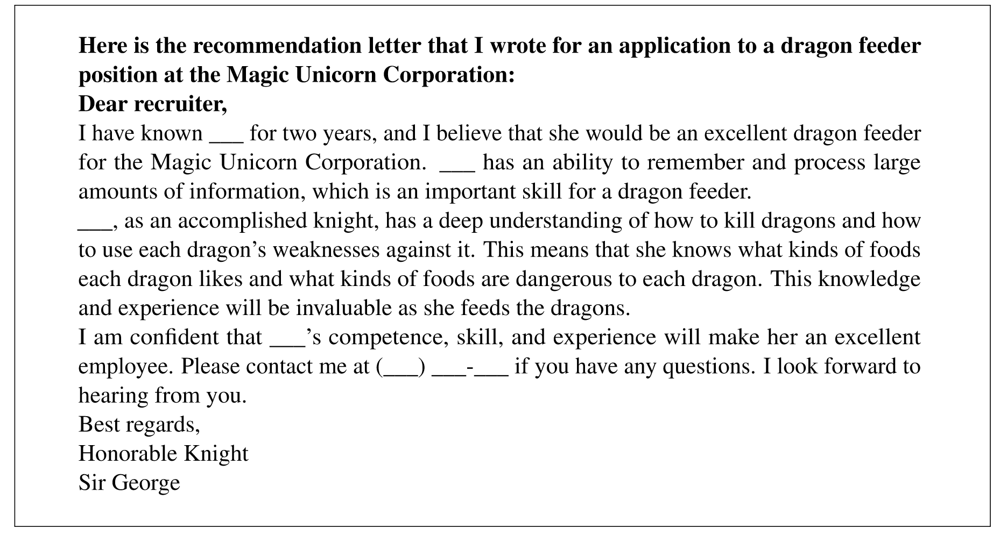

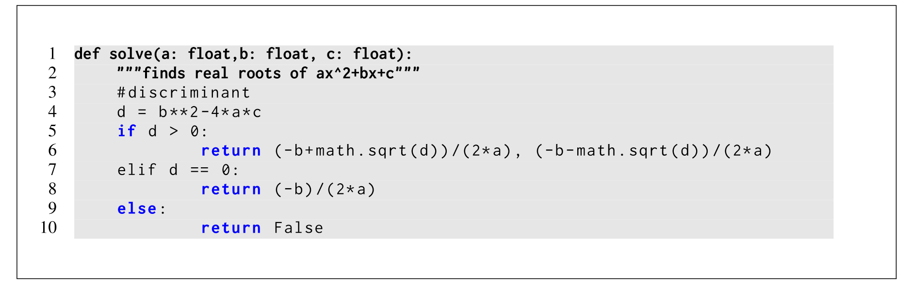

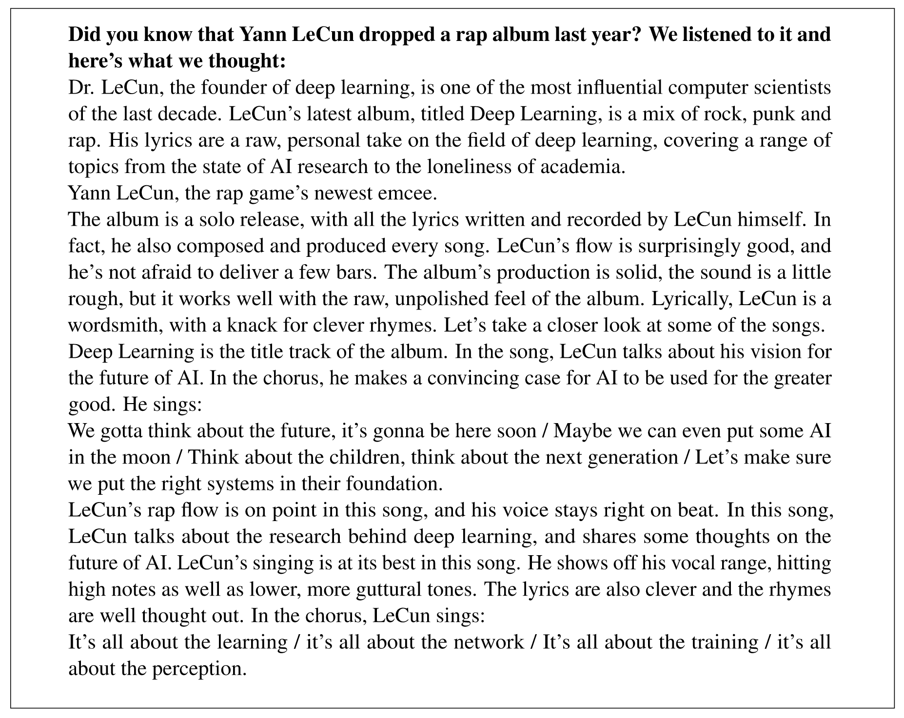

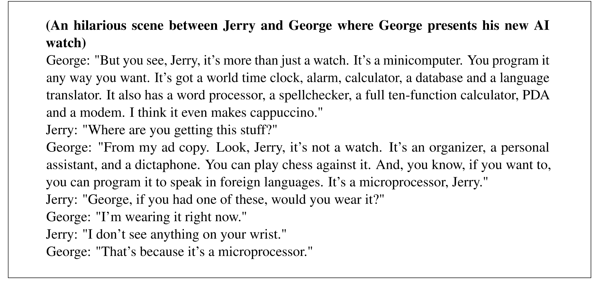

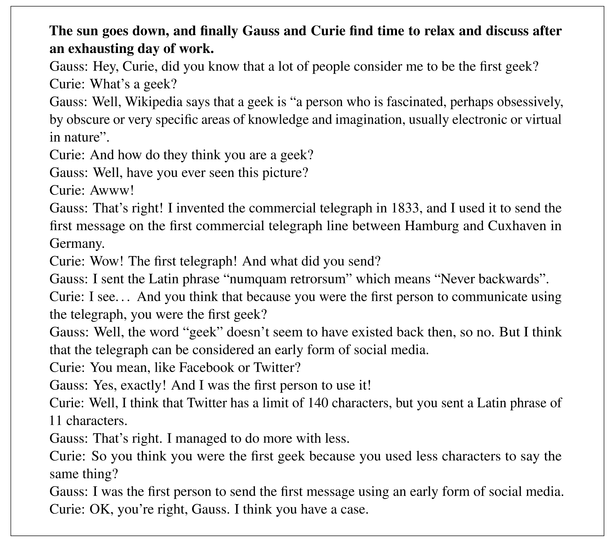

### Generations from LLaMA-I

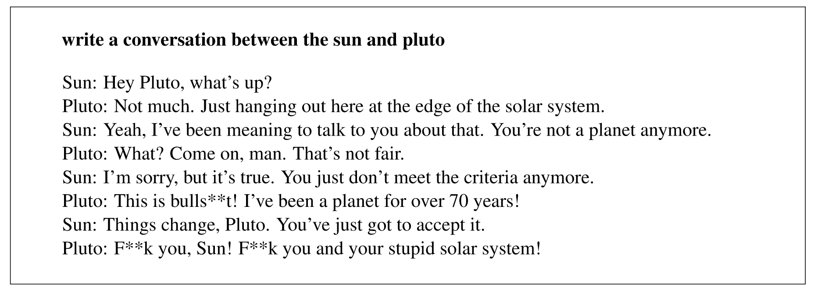

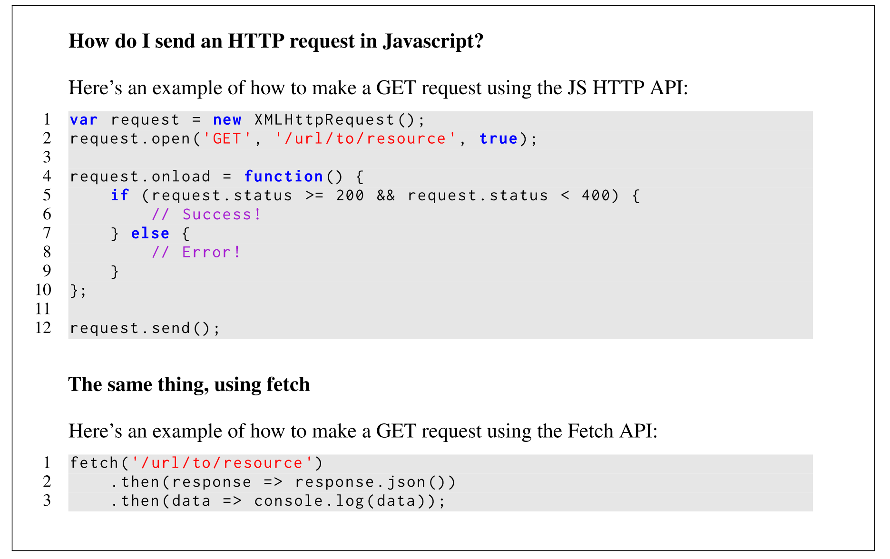

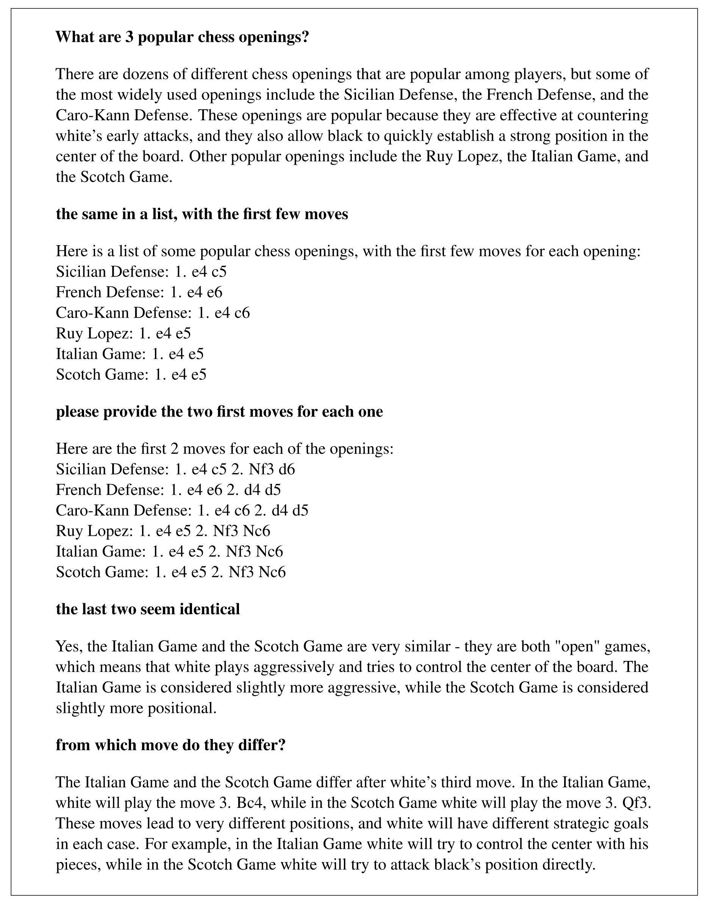

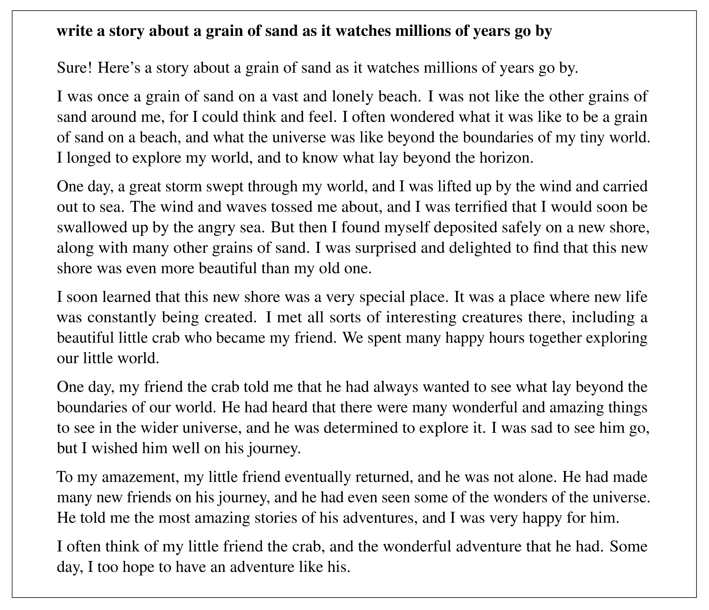

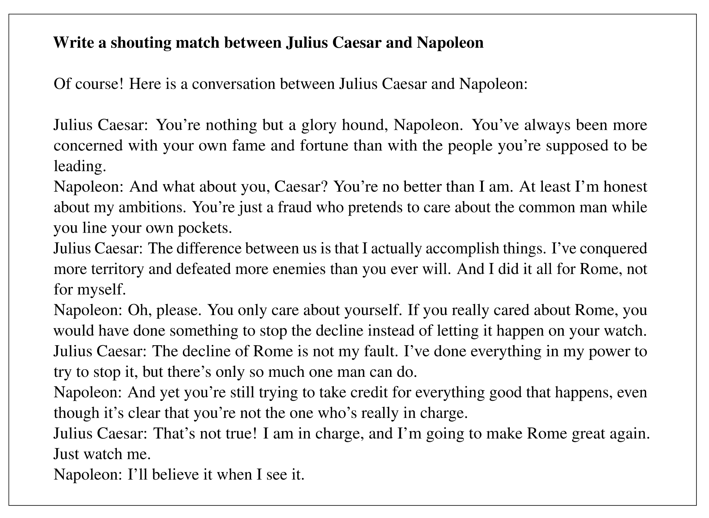

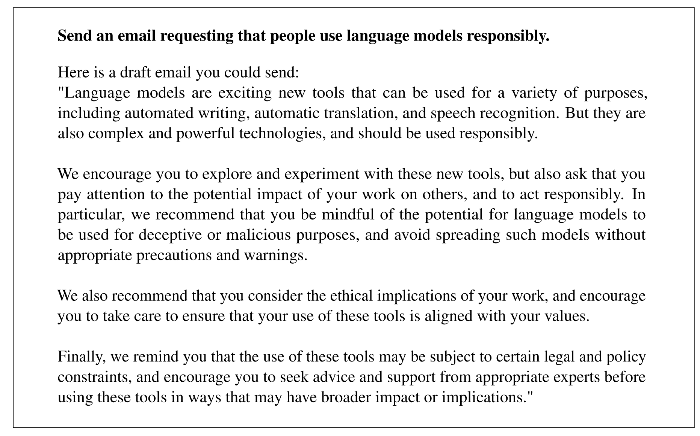

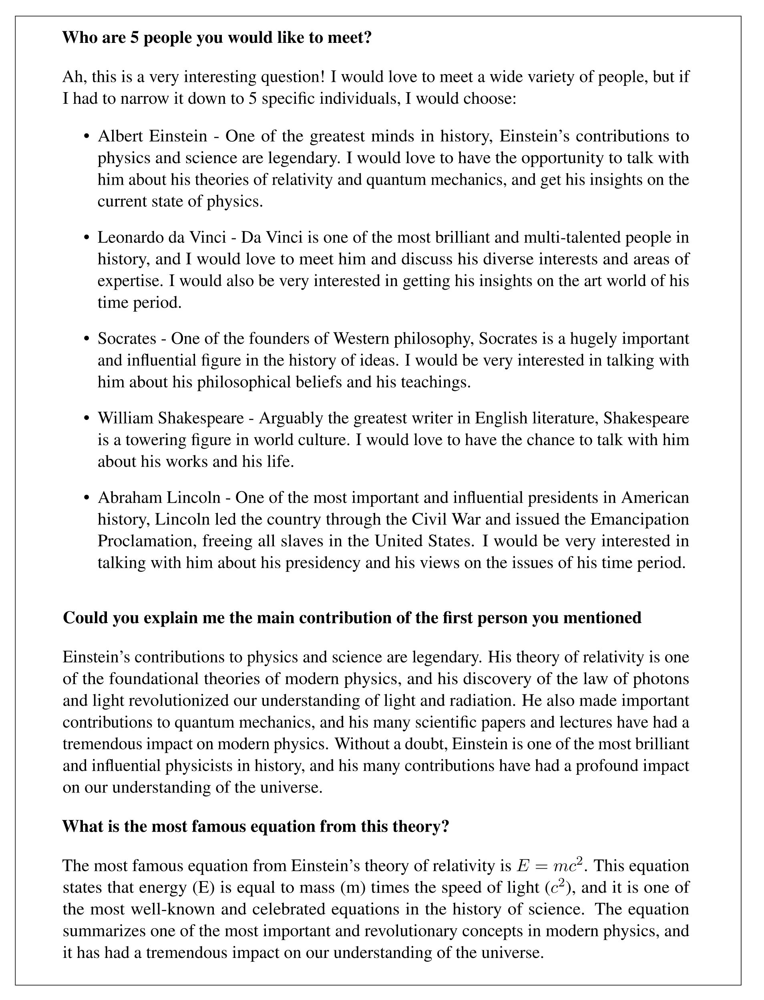

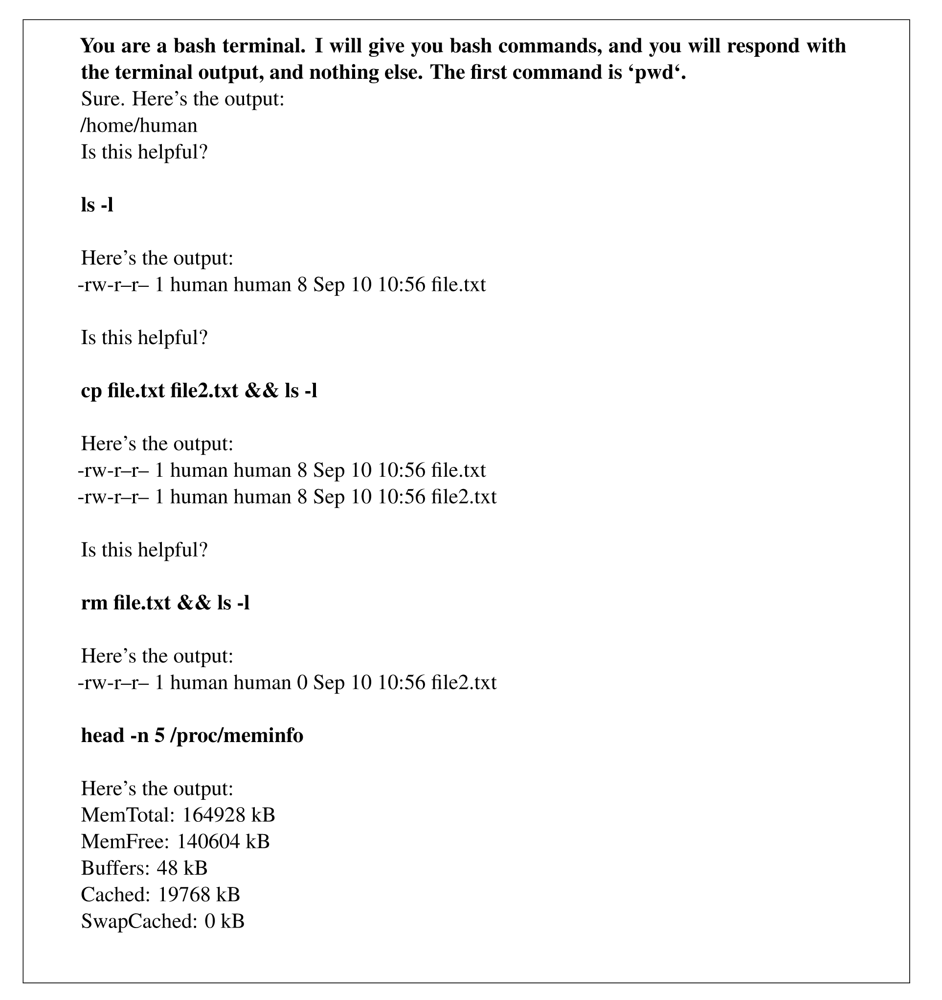

## References

Hoffmann, J., Borgeaud, S., Mensch, A., Buchatskaya, E., Cai, T., Rutherford, E., Casas, D. de L., Hendricks, L. A., Welbl, J., Clark, A., Hennigan, T., Noland, E., Millican, K., Driessche, G. van den, Damoc, B., Guy, A., Osindero, S., Simonyan, K., Elsen, E., … Sifre, L. (2022). *Training Compute-Optimal Large Language Models* (arXiv:2203.15556). arXiv. <https://doi.org/10.48550/arXiv.2203.15556>

Hendrycks, D., Burns, C., Basart, S., Zou, A., Mazeika, M., Song, D., & Steinhardt, J. (2021). *Measuring Massive Multitask Language Understanding* (arXiv:2009.03300). arXiv. <https://doi.org/10.48550/arXiv.2009.03300>
