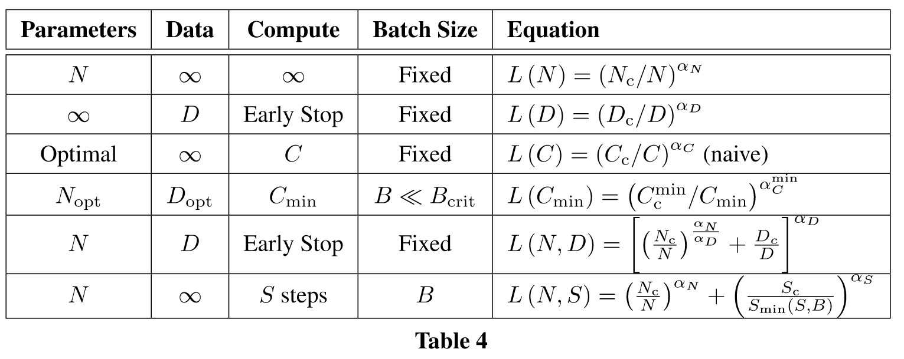
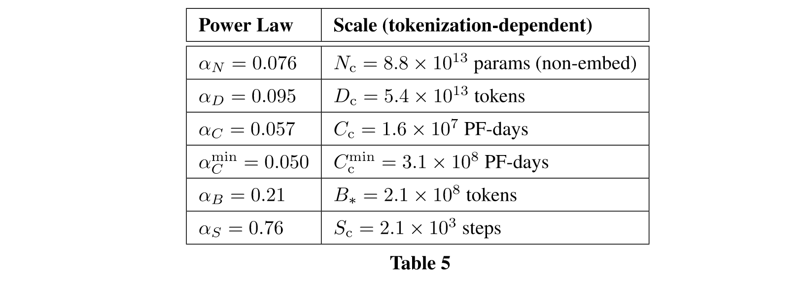
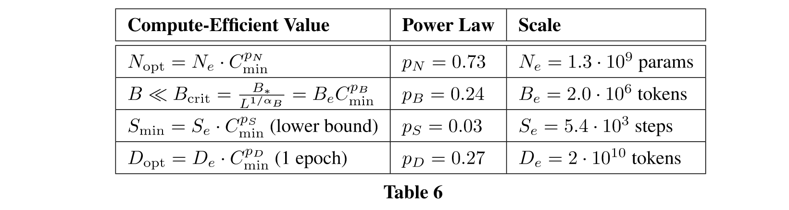

# Note on “Scaling Laws for Neural Language Models“

Abstract: We study empirical scaling laws for language model performance on the cross-entropy loss. The loss scales as a power-law with model size, dataset size, and the amount of compute used for training, with some trends spanning more than seven orders of magnitude. Other architectural details such as network width or depth have minimal effects within a wide range. Simple equations govern the dependence of overfitting on model/dataset size and the dependence of training speed on model size. These relationships allow us to determine the optimal allocation of a fixed compute budget. Larger models are significantly more sampleefficient, such that optimally compute-efficient training involves training very large models on a relatively modest amount of data and stopping significantly before convergence.

## Summary of Power Laws

For easier reference, we provide a summary below of the key trends described throughout the paper.

The empirical fitted values for these trends are:

The optimal parameters for compute efficient training are given by:

