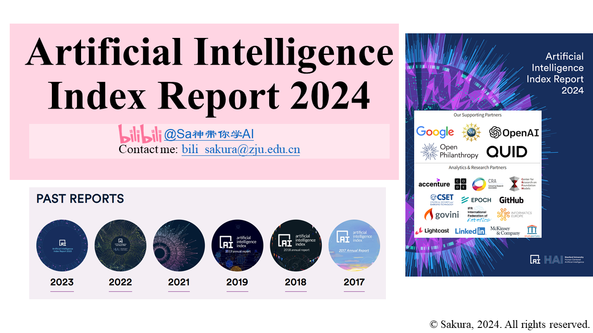
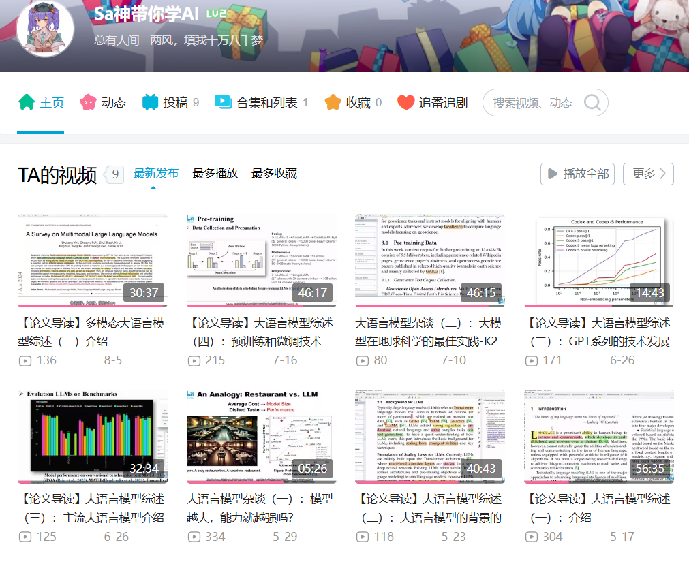

#  Course Repository  

> [!NOTE] Creator Information

- **Author:** Sakura
- **Date Created:** June 23, 2024
- **Last Updated:** Sep 16, 2024
- **Version:** 1.7

Profile of Sakura

## <a href="https://space.bilibili.com/3546681717033402" style="display: inline-block; padding: 10px 20px; background-color: #00A1D6; color: white; text-align: center; text-decoration: none; border-radius: 5px;">Bilibili Home Page</a>

LLM

| Title | Video | Category | Supplyment |
|-------|------|----------|----------|
| 【序】五分钟了解大语言模型 |  | LLM | [Keynote](./Bilibili_Course/LLM/PowerPoint/【序】五分钟了解大模型.pptx) |
| 【论文导读】大语言模型综述（一）：介绍 |  | LLM |  |
| 【论文导读】大语言模型综述（二）：大语言模型技术背景 |  | LLM |  |
| 【论文导读】大语言模型综述（三）：GPT系列的技术发展历程 |  | LLM | [Keynote](./Bilibili_Course/LLM/PowerPoint/【论文导读】大语言模型综述（二）：GPT系列的技术发展历程.pptx) |
| 【论文导读】大语言模型综述（四）：主流大语言模型介绍 |  | LLM | [Keynote](./Bilibili_Course/LLM/PowerPoint/【论文导读】大语言模型综述（三）：主流大语言模型介绍.pptx) |
| 【论文导读】大语言模型综述（五）：预训练和微调 |  | LLM | [Keynote](./Bilibili_Course/LLM/PowerPoint/【论文导读】大语言模型综述（四）：预训练和微调.pptx) |
| 大语言模型杂谈（一）：模型越大，能力就越强吗？ |  | LLM | [Keynote](./Bilibili_Course/LLM/PowerPoint/【Presentation】大语言模型杂谈（一）：模型越大，能力就越强吗？.pptx) |
| 大语言模型杂谈（二）：大模型在地球科学的最佳实践-K2 |  | LLM |  |

MLLM

| Title | Video | Category | Supplyment |
|-------|------|----------|----------|
| 【论文导读】多模态大语言模型综述（一）介绍 |  | MLLM |  |
| 【论文导读】多模态大语言模型综述（二）模型架构 |  | MLLM |  |
| 【论文导读】多模态大语言模型综述（三）训练技术和数据源 |  | MLLM |  |
| 【论文导读】多模态大语言模型综述（四）评估 |  | MLLM |  |
| 【论文导读】BLIP系列（一）：BLIP |  | MLLM | [Keynote](./Bilibili_Course/LLM/PowerPoint/BLIP.pptx) |
| 【论文导读】BLIP系列（二）：BLIP-2 |  | MLLM | [Keynote](./Bilibili_Course/LLM/PowerPoint/BLIP-2.pptx) |
| 【论文导读】BLIP系列（三）：InstructBLIP |  | MLLM | [Keynote](./Bilibili_Course/LLM/PowerPoint/InstructBLIP.pptx) |
| 【论文导读】BLIP系列（二）：BLIP-3 |  | MLLM | [Keynote](./Bilibili_Course/LLM/PowerPoint/BLIP-3.pptx) |
| 【论文导读】CogVLM系列（一）：CogVLM |  | MLLM |  |
| 【论文导读】CogVLM系列（二）：CogVLM Family |  | MLLM |  |

VLGFM

| Title | Video | Category | Supplyment |
|-------|------|----------|----------|
| 【论文导读】视觉语言地学大模型综述（一）导论 |  | VLGFM |  |
| 【论文导读】RSGPT: A remote sensing vision language model and benchmark |  | VLGFM |  |
| 【论文导读】RemoteCLIP: A vision language foundation model for remote sensing |  | VLGFM |  |
| 【论文导读】DiffusionSat:A generative foundation model for satellite imagery |  | VLGFM |  |
| 【论文导读】视觉语言地学大模型综述（二）模型能力和下游任务 |  | VLGFM |  |
| 【白皮书解读】1.1 空间数据智能大模型的定义及其发展历程 |  | SDIFM |  |
| 【白皮书解读】1.2 研究现状 |  | SDIFM |  |
| 【白皮书解读】1.3-1.4 空间数据智能大模型面临的挑战 |  | SDIFM |  |

Diffusion Model

| Title | Video | Category | Supplyment |
|-------|------|----------|----------|
|【代码讲解】十分钟快速上手扩散模型Stable Diffusion|  | Diffusion Model |  |
|【论文导读】Stable Diffusion（一）：介绍|  | Diffusion Model |  |
|【论文导读】Stable Diffusion（二）：相关工作|  | Diffusion Model |  |
|【双语】对抗生成网络（GAN）介绍 Generative Adversarial Networks|  | GAN |  |
|【双语】Variational Autoencoders|  | VAE |  |
|【双语】Vision Transformers - Explained and Implement|  | ViT |  |
| 【双语】The U-Net explained in 10 minutes |  | U-Net |  |
| 【双语】扩散模型原理概述 Why Does Diffusion Work Better than Auto-Regression |  | Diffusion Model |  |
| 【双语】Denoising Diffusion Probabilistic Models - Explained |  | Diffusion Model |  |
| 【双语】Denoising Diffusion Probabilistic Models Code - DDPM Pytorch Implementation||Diffusion Model||
| 【双语】Stable Diffusion from Scratch in PyTorch - Unconditional LDM |  | Diffusion Model |  |
| 【双语】Stable Diffusion from Scratch in PyTorch - Conditional LDM |  | Diffusion Model |  |
| 【英字】Coding Stable Diffusion from scratch in PyTorch |  | Diffusion Model |  |
| 【双语】ControlNet with Diffusion Models - Explanation and PyTorch Implementation |  | Diffusion Model |  |
| 【双语】Auto-Encoding Variational Bayes （ICLR2024 Test of Time Award） |  | VAE |  |
| 【双语】VQ-VAE ： Explanation and Implementation |  | VQ-VAE |  |
| 【双语】CNN Receptive Field |  | CNN |  |

OpenAI-Image Models

| Title | Video | Category | Supplyment |
|-------|------|----------|----------|
| 【论文导读】OpenAI图像工作系列（一）：iGPT |  | iGPT |  |
| 【双语】DALL-E：Explained and Implementation |  | DALL-E |  |
| 【论文导读】OpenAI图像工作系列（二）：DALL-E |  | DALL-E | [Keynote](./Bilibili_Course/Diffusion/Keynotes/DALL-E.pptx) |

Explainable AI

| Title | Video | Category | Supplyment |
|-------|------|----------|----------|
| 【双语】The moment we stopped understanding AI [AlexNet] |  | Visualization |  |
| 【双语】AI can't cross this line and we don't know why. |  | Scaling Law |  |
| 【双语】ICML2024-The Platonic Representation Hypothesis |  | Representation Learning |  |
| 【双语】Latent Space Visualisation PCA, t-SNE, UMAP |  | Visualization |  |

AI Index Report 2024

<a href="./Bilibili_Course/AI_Index/Keynotes/AI_Index.pptx" style="display: inline-block; padding: 10px 20px; background-color: pink; color: white; text-align: center; text-decoration: none; border-radius: 5px;">Keynote for AI Index Report</a>

| Title | Video | Category | 
|-------|------|----------|
| AI Index Report 2024 （一）：Overview |  | Overview | 
| AI Index Report 2024 （二）：Language |  | Language | 

<!-- ### Products

[AI for Geoscience: A Survey](./Products/【PaperWriting】AI_for_Geoscience_A_Survey.pdf)

[AI Safety and the Path to AGI: Insights from OpenAI](./Products/【PaperWriting】AI_Safety_and_the_Path_to_AGI_Insights_from_OpenAI.pdf)

[An Introduction to Novel Data Driven Weather Forecasting Models](./Products/【PaperWriting】An_Introduction_to_Novel_Data_Driven_Weather_Forecasting_Models.pdf) -->

<!-- ## Course Outline (Conception Version)

### A. 科研工具分享

> [!TIP]

> 面向群体：本科生&研究生  
> 观众定位：有较强科学意愿和学习意愿的高校学生  
> 视频平均时长: 5分钟  
> 视频定位：精简而系统的介绍各类科研辅助工具，旨在提升学生科研效率

#### 一、【必学】文献管理神器Zotero使用教程

[【序】Zotero介绍](./Bilibili_Course/ResearchTools/COURSE_NOTES/Markdown/%23【序】Zotero介绍.md)

[一、Zotero的安装和环境配置](./Bilibili_Course/ResearchTools/COURSE_NOTES/Markdown/%23%23【一】Zotero的安装和环境配置.md)

[二、Zotero推荐插件](./Bilibili_Course/ResearchTools/COURSE_NOTES/Markdown/%23%23%23【二】Zotero推荐插件.md)

[三、Zotero文献管理和协作技巧](./Bilibili_Course/ResearchTools/COURSE_NOTES/Markdown/%23%23%23%23【三】Zotero文献管理和协作技巧.md)

[四、Zotero注记技巧](./Bilibili_Course/ResearchTools/COURSE_NOTES/Markdown/%23%23%23%23%23【四】Zotero注记技巧.md)

#### 二、【必学】使用Vscode/Cursor进行科研笔记管理

[【序】Vscode/Cursor介绍]()

[一、Vscode/Cursor的安装和环境配置]()

[二、Vscode/Cursor推荐插件]()

[三、Vscode/Cursor资源管理和协作技巧]()

[四、Vscode/Cursor + GitHub全栈科研工作流构建]()

#### 三、【进阶】使用高级语言 [LaTeX](https://www.overleaf.com/learn/latex/Learn_LaTeX_in_30_minutes) 撰写笔记和论文

[一、LaTex语言介绍]()

[二、LaTex数学公式数学]()

[三、LaTex常用语法]()

[四、Overleaf在线LaTex论文编辑器]()

[五、Vscode + LaTex Workshop高效撰写你的期刊/会议论文]()

#### 四、其他（泛）科研辅助工具

[Gifcam动图截图工具]()

[SVG/ICON免费高清素材网站]()

[五分钟掌握Markdown语法]()

[五分钟掌握HTML语法]()

[五分钟学会LaTex数学公式书写]()

#### 五、（泛）科研杂谈

[什么是大数据/什么是第四科学研究范式？]()

[学术英语学习指南]()

### B. GIS制图系列教学

> [!TIP]

> 面向群体：本科生&研究生&社会人士  
> 观众定位：有较强科学意愿和学习意愿的高校学生&公司文员&自媒体编辑  
> 视频平均时长: 12分钟  
> 视频定位：系统性的教学开源制图软件`QGIS`的使用以及其他制图工具和技术，制图是**环境学、资源学、地球科学等专业**的必备技能，在人文社科领域也有广泛的应用；此外，公司文员和自媒体编辑等掌握简单的制图技术能有效提升报告的吸引力和质量

#### 一、QGIS教学

> [!CAUTION]存在<u>较多</u>同类产品竞争

#### 二、交互式地图制作教学

> [!CAUTION]存在少量同类产品竞争

### C. 遥感方向顶刊顶会论文导读

> [!TIP]

> 面向群体：从事遥感方向科学研究的高校研究生/博后/导师  
> 观众定位：本领域的一线科研工作者  
> 视频时长: 5分钟~15分钟  
> 视频定位：高质量的学术知识分享 & 前沿方向展望 & 泛学术场景讨论  
> 视频内容：遥感领域顶会顶刊论文导读，核心目标刊物[IEEE Transaction on Geoscience and Remote Sensing(TGRS)](https://ieeexplore.ieee.org/xpl/aboutJournal.jsp?punumber=36),辅助材料CVPR、ICCV、ECCV和ISPRS等

> [!NOTE] <a href="https://www.ccf.org.cn/Academic_Evaluation/By_category/">中国计算机学会推荐国际学术会议和期刊目录（2022）</a>

CCF-A: CVPR & ICCV  
CCF-B: ECCV & TGRS  

> [!NOTE] 地球科学方向高质量刊物

- ISPRS Journal of Photogrammetry and Remote Sensing
- Remote Sensing
- GeoInformatica
- International Journal of Digital Earth

#### 一、遥感顶刊论文导读

导读Demo

### D. 大语言模型入门导读和简易实践

> [!TIP]

> 面向群体：对大语言模型理论和实践感兴趣的学生/社会人士  
> 视频时长: ~  
> 视频内容：经典入门论文导读 | 简易实践项目 | 简易工程开发 | LLM顶会论文前沿导读

Demo

 -->
