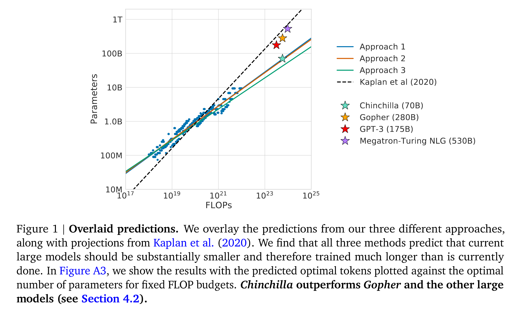
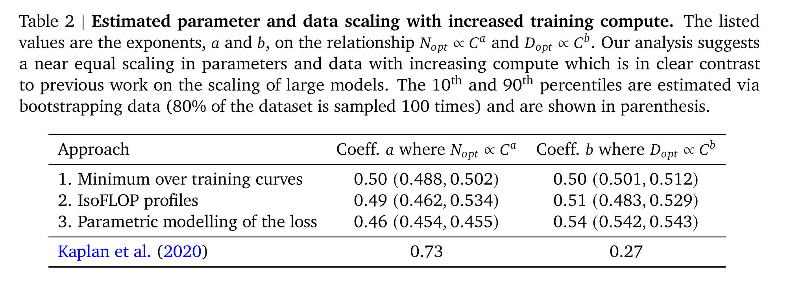
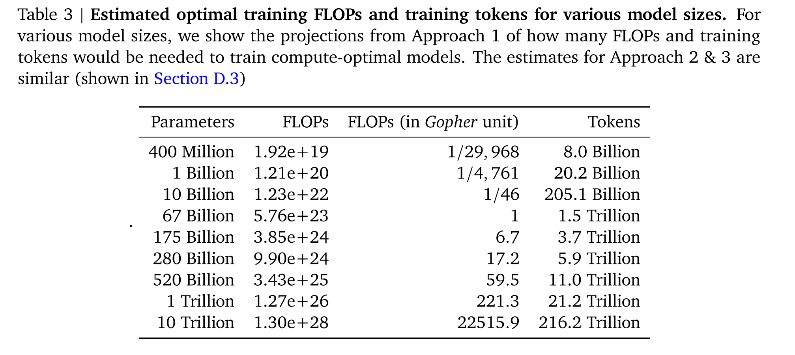
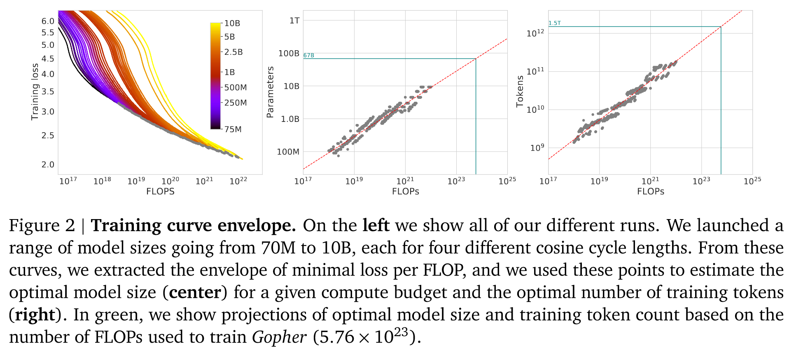
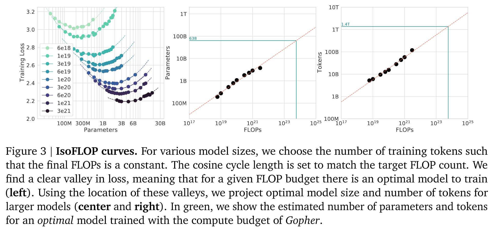

# Report on Chinchilla

Abstract: We investigate the optimal **model size and number of tokens** for training a transformer language model under a given compute budget. We find that current large language models are significantly undertrained, a consequence of the recent focus on scaling language models whilst keeping the amount of training data constant. By training over 400 language models ranging from 70 million to over 16 billion parameters on 5 to 500 billion tokens, we find that for compute-optimal training, the model size and the number of training tokens should be scaled equally: for every doubling of model size the number of training tokens should also be doubled. We test this hypothesis by training a predicted computeoptimal model, **Chinchilla**, that uses the same compute budget as Gopher but with 70B parameters and 4 more more data. Chinchilla uniformly and significantly outperforms Gopher (280B), GPT-3 (175B), Jurassic-1 (178B), and Megatron-Turing NLG (530B) on a large range of downstream evaluation tasks. This also means that Chinchilla uses substantially less compute for fine-tuning and inference, greatly facilitating downstream usage. As a highlight, Chinchilla reaches a state-of-the-art average accuracy of 67.5% on the MMLU benchmark, greater than a 7% improvement over Gopher.

## Introduction

Since it is typically only feasible to train these large models once, accurately estimating the best model hyperparameters for a given compute budget is critical . (<a href="zotero://select/library/items/DZR29GI8">Tay et al., 2021</a>)

Kaplan et al. (2020) showed that there is a power law relationship between the number of parameters in an autoregressive language model (LM) and its performance.

We empirically estimate these functions based on the losses of over 400 models, ranging from under 70M to over 16B parameters, and trained on 5B to over 400B tokens – with each model configuration trained for several different training horizons. Our approach leads to considerably different results than that of Kaplan et al. (2020). We highlight our results in Figure 1 and how our approaches differ in Section 2.

## Estimating the optimal parameter/training tokens allocation

We present three different approaches to answer the question driving our research: Given a fixed FLOPs budget, how should one trade-off model size and the number of training tokens? In all three cases we start by training a range of models varying both model size and the number of training tokens and use the resulting training curves to fit an empirical estimator of how they should scale. We assume a power-law relationship between compute and model size as done in Clark et al. (2022); Kaplan et al. (2020), though future work may want to include potential curvature in this relationship for large model sizes. The resulting predictions are similar for all three methods and suggest that parameter count and number of training tokens should be increased equally with more compute with proportions reported in Table 2. This is in clear contrast to previous work on this topic and warrants further investigation.

In Table 3 we show the estimated number of FLOPs and tokens that would ensure that a model of a given size lies on the compute-optimal frontier. Our findings suggests that the current generation of large language models are considerably over-sized, given their respective compute budgets, as shown in Figure 1. For example, we find that a 175 billion parameter model should be trained with a compute budget of 4“41 1024 FLOPs and on over 4.2 trillion tokens. A 280 billion Gopher-like model is the optimal model to train given a compute budget of approximately 1025 FLOPs and should be trained on 6.8 trillion tokens. Unless one has a compute budget of 1026 FLOPs (over 250 the compute used to train Gopher), a 1 trillion parameter model is unlikely to be the optimal model to train. Furthermore, the amount of training data that is projected to be needed is far beyond what is currently used to train large models, and underscores the importance of dataset collection in addition to engineering improvements that allow for model scale. While there is significant uncertainty extrapolating out many orders of magnitude, our analysis clearly suggests that given the training compute budget for many current LLMs, smaller models should have been trained on more tokens to achieve the most performant model.

### Approach 1: Fix model sizes and vary number of training tokens

In our first approach we vary the number of training steps for a fixed family of models (ranging from 70M to over 10B parameters), training each model for 4 different number of training sequences. From these runs, we are able to directly extract an estimate of the minimum loss achieved for a given number of training FLOPs. Training details for this approach can be found in Appendix D. For each parameter count 𝑁 we train 4 different models, decaying the learning rate by a factor of 10 over a horizon (measured in number of training tokens) that ranges by a factor of 16. Then, for each run, we smooth and then interpolate the training loss curve. From this, we obtain a continuous mapping from FLOP count to training loss for each run. Then, for each FLOP count, we determine which run achieves the lowest loss. Using these interpolants, we obtain a mapping from any FLOP count 𝐶, to the most efficient choice of model size 𝑁 and number of training tokens 𝐷 such that FLOPs(𝑁”,𝐷) = 𝐶. At 1500 logarithmically spaced FLOP values, we find which model size achieves the lowest loss of all models along with the required number of training tokens. Finally, we fit power laws to estimate the optimal model size and number of training tokens for any given amount of compute (see the center and right panels of Figure 2), obtaining a relationship  $N_{opt} \propto C^a$ and $D_{opt} \propto C^b$  . We find that 𝑎 = 0“.50 and 𝑏 = 0“.50—as summarized in Table 2. In Section D.4, we show a head-to-head comparison at $ 10^{21}$ FLOPs, using the model size recommended by our analysis and by the analysis of Kaplan et al. (2020)—using the model size we predict has a clear advantage.

### Approach 2: IsoFLOP profiles

In our second approach we vary the model size for a fixed set of 9 different training FLOP counts(ranging from $ 6 \times10^{18}$ to $ 3 \times10^{21}$ FLOPs), and consider the final training loss for each point. in contrast with Approach 1 that considered points (𝑁”,𝐷”,𝐿) along the entire training runs. This allows us to directly answer the question: For a given FLOP budget, what is the optimal parameter count?

For each FLOP budget, we plot the final loss (after smoothing) against the parameter count in Figure 3 (left). In all cases, we ensure that we have trained a diverse enough set of model sizes to see a clear minimum in the loss. We fit a parabola to each IsoFLOPs curve to directly estimate at what model size the minimum loss is achieved (Figure 3 (left)). As with the previous approach, we then fit a power law between FLOPs and loss-optimal model size and number of training tokens, shown in Figure 3 (center, right). Again, we fit exponents of the form $N_{opt} \propto C^a$ and $D_{opt} \propto C^b$  and we find that 𝑎 = 0“49 and 𝑏 = 0.“51—as summarized in Table 2.

### Approach 3: Fitting a parametric loss function

Lastly, we model all final losses from experiments in Approach 1 & 2 as a parametric function of model parameter count and the number of seen tokens. Following a classical risk decomposition (see Section D.2), we propose the following functional form

$$    \hat L(N,D) \triangleq E + \frac{A}{N^\alpha} + \frac{B}{D^\beta}. 
$$

The first term captures the loss for an ideal generative process on the data distribution, and should correspond to the entropy of natural text. The second term captures the fact that a perfectly trained transformer with 𝑁 parameters underperforms the ideal generative process. The final term captures the fact that the transformer is not trained to convergence, as we only make a finite number of optimisation steps, on a sample of the dataset distribution.

…

We show contours of the fitted function $ \hat L$ in Figure 4 (left), and the closed-form efficient computational frontier in blue. From this approach, we find that 𝑎 = 0“.46 and 𝑏 = 0“.54—as summarized in Table 2.

## References

Tay, Y., Dehghani, M., Rao, J., Fedus, W., Abnar, S., Chung, H. W., Narang, S., Yogatama, D., Vaswani, A., & Metzler, D. (2021). Scale Efficiently: Insights from Pre-training and Fine-tuning Transformers. *ArXiv*. <https://www.semanticscholar.org/paper/Scale-Efficiently%3A-Insights-from-Pre-training-and-Tay-Dehghani/2d4f66046bb436864cd6bf589e3a931c405f9f44>

A. Clark, D. d. l. Casas, A. Guy, A. Mensch, M. Paganini, J. Hoffmann, B. Damoc, B. Hechtman, T. Cai, S. Borgeaud, G. v. d. Driessche, E. Rutherford, T. Hennigan, M. Johnson, K. Millican, A. Cassirer, C. Jones, E. Buchatskaya, D. Budden, L. Sifre, S. Osindero, O. Vinyals, J. Rae, E. Elsen, K. Kavukcuoglu, and K. Simonyan. Unified scaling laws for routed language models, 2022. URL https\://arxiv.org/abs/2202.01169.

J. Kaplan, S. McCandlish, T. Henighan, T. B. Brown, B. Chess, R. Child, S. Gray, A. Radford, J. Wu, and D. Amodei. Scaling laws for neural language models. arXiv preprint arXiv:2001.08361, 2020.
