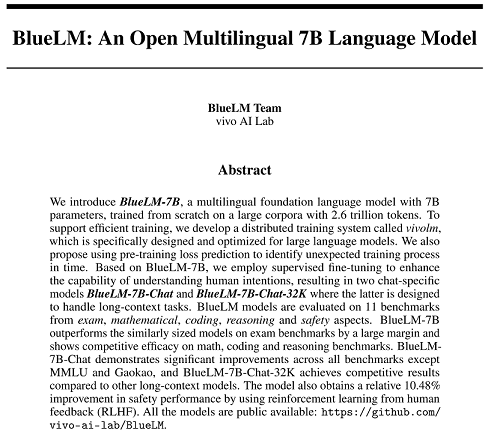
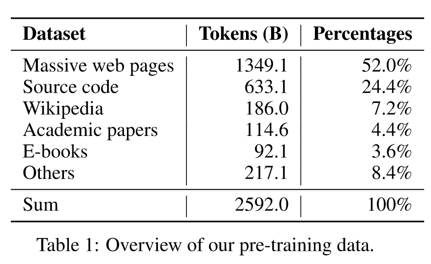
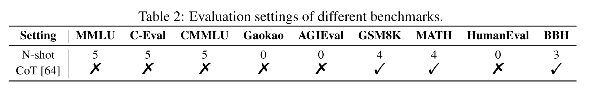
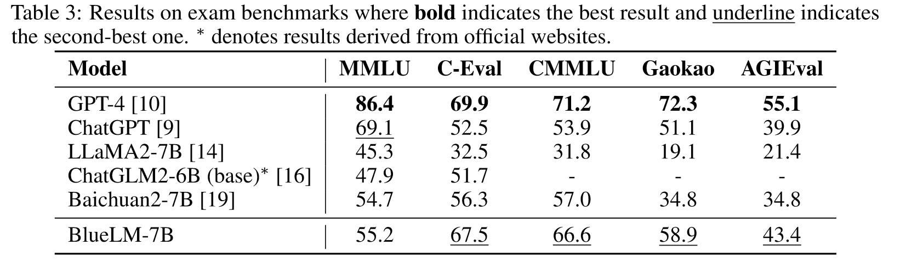

# 调研报告

[BlueLM技术报告](attachments/BlueLM_technical_report.pdf)

---

**Abstract**: We introduce BlueLM-7B, a multilingual foundation language model with 7B parameters, trained from scratch on a large corpora with 2.6 trillion tokens. To support efficient training, we develop a distributed training system called vivolm, which is specifically designed and optimized for large language models. We also propose using pre-training loss prediction to identify unexpected training process in time. Based on BlueLM-7B, we employ supervised fine-tuning to enhance the capability of understanding human intentions, resulting in two chat-specific models BlueLM-7B-Chat and BlueLM-7B-Chat-32K where the latter is designed to handle long-context tasks. BlueLM models are evaluated on 11 benchmarks from exam, mathematical, coding, reasoning and safety aspects. BlueLM-7B outperforms the similarly sized models on exam benchmarks by a large margin and shows competitive efficacy on math, coding and reasoning benchmarks. BlueLM7B-Chat demonstrates significant improvements across all benchmarks except MMLU and Gaokao, and BlueLM-7B-Chat-32K achieves competitive results compared to other long-context models. The model also obtains a relative 10.48% improvement in safety performance by using reinforcement learning from human feedback (RLHF). [Code](https://github.com/vivo-ai-lab/BlueLM) 

---

## Pretrain

---

## Evaluation

- Benchmarks

- Baseline

- Results

---

### Benchmarks

Given the versatility of language models, their evaluation must be conducted from various perspectives. In this work, we evaluated BlueLM-7B using 9 benchmarks for 4 specific types of model’s capabilities, including **exams, math, coding and reasoning**. These benchmarks are complementary and combining them together provides a more complete and solid evaluation. The details are listed below. 

---
### Benchmarks:Exams

*Exams* The use of comprehensive exams, which are designed to assess the models’ overall performance across various tasks and domains, takes into account the potential of models for general intelligence similar to human beings. We use five exam benchmarks, including: 

---

### Benchmarks:Exams

• MMLU [25]: A multi-task benchmark consists of multiple-choice questions covering 57 domain of knowledge, including elementary mathematics, American history, computer science, law, economics, etc. 
• C-Eval [26]: The first comprehensive Chinese benchmark consists of about 14K multiplechoice questions in 52 subjects, covering mathematics, physics, chemistry, biology, history, computer science, etc. 
• CMMLU [27]: Another general Chinese benchmark covering 67 subjects, designed for evaluating the knowledge and reasoning abilities of language models within the context of the Chinese language and culture. 
• Gaokao [28]: An Chinese benchmark based on Chinese college entrance examination to evaluate the language understanding and logical reasoning abilities of language models. 
• AGIEval [29]: A human-centric benchmark developed by Microsoft, which is specifically designed to evaluate the general abilities like human cognition and problem-solving, consisting of 19 task sets derived from various exams in China and the Unite States. 

---

### Benchmarks:Math & Reasoning

*Math* We use 2 benchmarks to evaluate the capabilities of mathematical understanding and quantitative reasoning: 
• GSM8K [30]: A mathematical dataset contains 8.5K high-quality linguistically diverse grade school math word problems. 
• MATH [31]: A new dataset collects 12,500 challenging problems from high school mathematics competitions. Coding We test the coding capabilities by using HumanEval [32] benchmark, a Python code dataset of consisting of 164 code problems to evaluate different aspects of programming logic.

*Reasoning* The general reasoning capabilities is evaluated on BBH [33] benchmark, a subset of BIG-Bench [61] benchmark, containing 23 challenging tasks that the language models did not outperform the average human-rater.

Considering the diverse range of tasks, we have integrated open-source evaluation frameworks, such as lm-evaluation-harness [62] and OpenCompass [63], into our in-house implementations to ensure a fair comparison with other models.

---

### Baselines

We mainly compare BlueLM-7B with three other pretrained language models: LLaMA2-7B [14], Baichuan2-7B [19], and ChatGLM2-6B (base) [16]. These models were chosen because of their comparable size and open source nature, enhancing the reproduciblity of the evaluation results. In addition, we also include the results of GPT-4 [10] and ChatGPT [9], the state-of-the-art language models, for reference. 

---

### Baselines

• LLaMA2-7B [14] is an open source language model trained on 2 trillion tokens. The context length is 4096. 
• ChatGLM2-6B (base) [16] is an open source chat language model trained on 1.4 trillion bilingual tokens. 
• Baichuan2-7B [19] is an open source language model trained on 2.6 trillion tokens with a focus on both English and Chinese, which achieves strong performance on several benchmarks. 
• ChatGPT [9] is a chat language model developed by OpenAI, derived from a GPT-3 [8] variant and InstructGPT [59] approach. Owing to its superior performance, it has gained significant attention and emerged as a widely-used baseline for language models. 
• GPT-4 [10] represents a state-of-the-art multi-modal language model developed by OpenAI, displaying a superior capabilities of complex reasoning over ChatGPT [9].

---

### Results

---

## References

[9] OpenAI. Openai: Introduing chatgpt, 2022.

[10] OpenAI. Gpt-4 technical report, 2023.

[14] Hugo Touvron, Louis Martin, Kevin Stone, Peter Albert, Amjad Almahairi, Yasmine Babaei, Nikolay Bashlykov, Soumya Batra, Prajjwal Bhargava, Shruti Bhosale, et al. Llama 2: Open foundation and fine-tuned chat models. arXiv preprint arXiv:2307.09288, 2023.

[15] Aohan Zeng, Xiao Liu, Zhengxiao Du, Zihan Wang, Hanyu Lai, Ming Ding, Zhuoyi Yang, Yifan Xu, Wendi Zheng, Xiao Xia, et al. Glm-130b: An open bilingual pre-trained model. arXiv preprint arXiv:2210.02414, 2022.

[16] chatGLM2 Team. Chatglm2-6b: An open bilingual chat llm. https://github.com/THUDM/ ChatGLM2-6B, 2023.

---

[17] InternLM Team. Internlm: A multilingual language model with progressively enhanced capabilities. https://github.com/InternLM/InternLM, 2023.

[18] Jinze Bai, Shuai Bai, Yunfei Chu, Zeyu Cui, Kai Dang, Xiaodong Deng, Yang Fan, Wenbin Ge, Yu Han, Fei Huang, et al. Qwen technical report. arXiv preprint arXiv:2309.16609, 2023.

[19] Aiyuan Yang, Bin Xiao, Bingning Wang, Borong Zhang, Chao Yin, Chenxu Lv, Da Pan, Dian Wang, Dong Yan, Fan Yang, et al. Baichuan 2: Open large-scale language models. arXiv preprint arXiv:2309.10305, 2023.

---

[25] Dan Hendrycks, Collin Burns, Steven Basart, Andy Zou, Mantas Mazeika, Dawn Song, and Jacob Steinhardt. Measuring massive multitask language understanding. arXiv preprint arXiv:2009.03300, 2020.

[26] Yuzhen Huang, Yuzhuo Bai, Zhihao Zhu, Junlei Zhang, Jinghan Zhang, Tangjun Su, Junteng Liu, Chuancheng Lv, Yikai Zhang, Jiayi Lei, et al. C-eval: A multi-level multi-discipline chinese evaluation suite for foundation models. arXiv preprint arXiv:2305.08322, 2023.

[27] Haonan Li, Yixuan Zhang, Fajri Koto, Yifei Yang, Hai Zhao, Yeyun Gong, Nan Duan, and Timothy Baldwin. Cmmlu: Measuring massive multitask language understanding in chinese. arXiv preprint arXiv:2306.09212, 2023.

[28] Xiaotian Zhang, Chunyang Li, Yi Zong, Zhengyu Ying, Liang He, and Xipeng Qiu. Evaluating the performance of large language models on gaokao benchmark. arXiv preprint arXiv:2305.12474, 2023.

---

[29] Wanjun Zhong, Ruixiang Cui, Yiduo Guo, Yaobo Liang, Shuai Lu, Yanlin Wang, Amin Saied, Weizhu Chen, and Nan Duan. Agieval: A human-centric benchmark for evaluating foundation models. arXiv preprint arXiv:2304.06364, 2023.

[30] Karl Cobbe, Vineet Kosaraju, Mohammad Bavarian, Mark Chen, Heewoo Jun, Lukasz Kaiser, Matthias Plappert, Jerry Tworek, Jacob Hilton, Reiichiro Nakano, et al. Training verifiers to solve math word problems. arXiv preprint arXiv:2110.14168, 2021.

[31] Dan Hendrycks, Collin Burns, Saurav Kadavath, Akul Arora, Steven Basart, Eric Tang, Dawn Song, and Jacob Steinhardt. Measuring mathematical problem solving with the math dataset. arXiv preprint arXiv:2103.03874, 2021.

---

[32] Mark Chen, Jerry Tworek, Heewoo Jun, Qiming Yuan, Henrique Ponde de Oliveira Pinto, Jared Kaplan, Harri Edwards, Yuri Burda, Nicholas Joseph, Greg Brockman, et al. Evaluating large language models trained on code. arXiv preprint arXiv:2107.03374, 2021.

[33] Mirac Suzgun, Nathan Scales, Nathanael Schärli, Sebastian Gehrmann, Yi Tay, Hyung Won Chung, Aakanksha Chowdhery, Quoc V Le, Ed H Chi, Denny Zhou, et al. Challenging big-bench tasks and whether chain-of-thought can solve them. arXiv preprint arXiv:2210.09261, 2022.